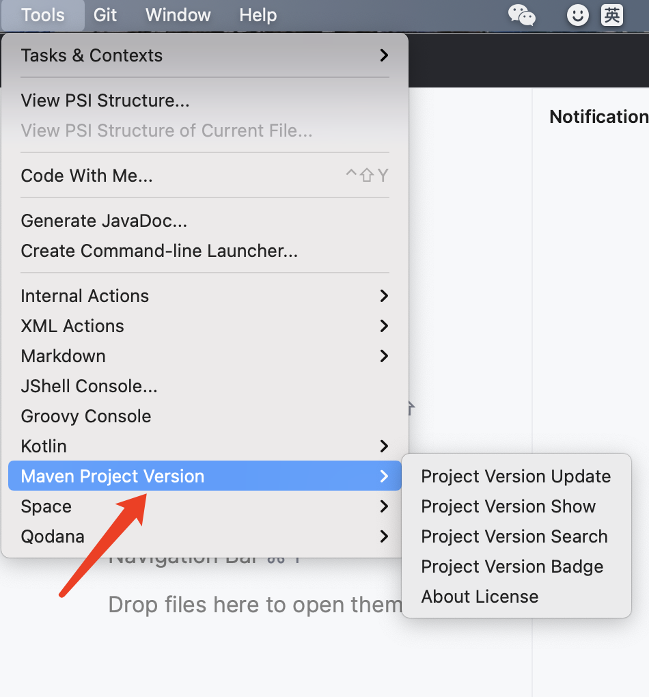

# Maven With Me(MPVP) - Maven Project Version Plugin

[](https://plugins.jetbrains.com/plugin/27647-maven-with-me-mpvp-)
[](https://plugins.jetbrains.com/plugin/29269-maven-with-me-pro-mpvp-)
[%20downloads&labelColor=5d3623&color=green)](https://plugins.jetbrains.com/plugin/24176-mpvp-maven-)
[](./README.md)
[](./README_en.md)
[](https://joker-pper.github.io/intellij-mpvp-maven/)
[](docs/LICENSE_Page.md)

<div align="center" style="text-align: center;">
    
</div>

Maven项目版本插件，可用于版本快速傻瓜式升级及项目版本展示和项目版本搜索并支持快速生成常见项目版本的徽章.

<span style="color: red; font-weight: 300;">欢迎使用 Maven With Me(MPVP)。 如果您是中国大陆以外的用户，请使用 Maven With Me Pro(MPVP)。</span>

<span style="color: red; font-weight: 500;">现有PRO版 -- IDEA 插件Maven With Me Pro(MPVP)可通过 JetBrains 官方激活使用，激活可享受 JetBrains 官方安全支付渠道及发票！</span>

<p>注：若您使用的是Gradle，对应的IDEA 插件为 Gradle With Me(GPVP)。 如果您是中国大陆以外的用户，请使用 Gradle With Me Pro(GPVP)。</p>

<hr/>

<p style="font-size: 20px; font-weight: bold; color:red;">
    新增好物推荐模块（来自淘宝/京东官方推广的商品，会比平常直接购买有一些优惠或者价格一样，也是影响发布试用插件频次的重要指标），希望大家能多多支持！
</p>
<hr/>
<p style="font-size: 20px; font-weight: bold; color:red;">
欢迎大家加入交流群，不仅能在第一时间获取最新插件资源，还能一起交流学习！
</p>

QQ交流群: [550996296（点击加群）](http://qm.qq.com/cgi-bin/qm/qr?_wv=1027&k=50F30oecs4iVEfMBlRK4fhfLIzLlV6-t&authKey=i%2BrfuFb1IrbqEmE3QT5GCOF75A0LXsoriZN9951IbY7eezZpoQgvskOkK513z2Bf&noverify=0&group_code=550996296)

微信交流群: 在微信公众号 <a style="color: rgb(255, 76, 65);" href="https://mp.weixin.qq.com/mp/profile_ext?action=home&__biz=MzkyODk0MTA1MA==&scene=124#wechat_redirect" target="_blank">“新程快咖员”</a>（<a href="https://mp.weixin.qq.com/mp/qrcode?scene=10000004&size=102&__biz=MzkyODk0MTA1MA==&mid=2247483700&idx=1&sn=2a00414552461b2235b1d4b5b6878f16&send_time=" target="_blank">点击查看二维码</a>）直接留言<span textstyle="" style="color: rgb(255, 76, 0)">“微信群”</span>即可获取

<p style="font-size: 15px; font-weight: 500; color:red;">福利：加群可申请解锁最大试用次数，关注公众号可申请解锁最大试用时间段</p>

<hr/>

<p style="font-size: 15px; font-weight: bold;">
插件“MPVP(Maven)”已变更为<span style="color: rgb(255, 76, 65);">“Maven With Me(MPVP)”</span>插件，后续“MPVP(Maven)”将不再维护。

建议您卸载当前安装的“MPVP(Maven)”插件（可能会和“Maven With Me(MPVP)”插件冲突）并在插件市场搜索关键字<span style="color: rgb(255, 76, 65);">“MPVP”</span>切换为<span style="color: rgb(255, 76, 65);">“Maven With Me(MPVP)”</span>插件。
</p>

<hr/>

> 细分插件

[](https://plugins.jetbrains.com/plugin/27628-maven-update-mpvp-)
[](https://plugins.jetbrains.com/plugin/27627-maven-search-mpvp-)
[](https://plugins.jetbrains.com/plugin/29271-maven-update-pro-mpvp-)
[](https://plugins.jetbrains.com/plugin/29270-maven-search-pro-mpvp-)
<hr/>

## 前言

工欲善其事必先利其器！想必大家在使用maven时会经常碰到项目版本升级和依赖版本升级的问题吧。针对占用大家大量时间以及大家经常使用遇到的痛点，这款插件诞生了！！！
轻松帮您解决搜索依赖困扰和升级版本困扰！ 轻便快捷是初心，势必为节省您的大量时间和心力而前行！让更多的时间和价值留在更重要的地方！！！<br/>
<b>希望它能成为一款真正有价值的插件，避免大家花费更多的精力和心力在这些繁琐的流程中。当然这也需要您的支持，以便我们提供更好的服务和迭代，利他和利己不是可以共存的嘛~ 让我们一起走得更远！</b><br/>

<br/>
<hr/>

## 更新计划

版本号: <span style="color: red">2.6.x</span>

预计发布时间: <span style="color: red">???</span>

详情: [戳这里直达](docs/Next.md)

## 特性

### 支持maven项目版本快速升级/回退

无论是快照版还是release版，输入后提交一键轻松帮您搞定版本值升级或回退（再也不用头疼和花费大量时间调整版本值啦）。还会为您展示修改的具体细节~ 简化您的工作流程，为您节省大量宝贵时间！

### 支持maven项目版本展示

可直接在项目视图中展示版本值，一眼便能知晓当下版本~ 并提供自定义展示规则能力。

### 支持maven/gradle项目依赖版本搜索

支持查询中央仓库最新依赖版本，也可以快速查询Nexus仓库(远程/私服)依赖版本。简化您的工作流程，为您节省大量宝贵时间！<br/>
提供便捷式搜索能力(Maven pom配置或Gradle依赖配置粘贴后即可查询，也可通过关键字进行查询)， 一键复制依赖坐标，
<span style="color: rgb(255, 76, 65);">一键访问文件目录（兼容Nexus低版本）</span>，<span style="color: rgb(255, 76, 65);">一键加载更新时间（兼容Nexus低版本）</span>，快速查看版本详情页等，欢迎上手体验~

### 支持maven/gradle项目版本徽章生成

支持快速生成常见Maven/Gradle项目版本的徽章 (依赖<span style="color: rgb(255, 76, 65);">shields.io</span>能力)。<span style="color: rgb(255, 76, 65);">提供常见参数使用，可快速自定义文本及颜色。</span>提供支持<span style="color: rgb(255, 76, 65);">groupId+artifactId快速输入能力</span>(如Maven pom配置或Gradle依赖配置粘贴即可)，并<span style="color: rgb(255, 76, 65);">内置常用徽章的跳转链接</span>(如发布到中央仓库release jar的版本链接)及<span style="color: rgb(255, 76, 65);">自定义跳转链接</span>，为您徽章的生成<span style="color: rgb(255, 76, 65);">提供一定的便捷</span>~


### 国际化支持

支持英文、中文、简体中文（中国）及中文（台湾）

<span style="color: red">注：</span>如要了解更多，[请点击这里查看特性详请](docs/FeaturesDetail.md)


## 如何找到操作菜单？

Tools > Maven Project Version



## 功能对比

| 功能      | 试用（无授权KEY）                     | 试用（有授权KEY）     | 正常激活                  |
|---------|--------------------------------|----------------|-----------------------|
| **好物推荐** | 无限次数，希望大家多多支持，会影响发布试用插件频次      | 无限次数，希望大家多多支持，会影响发布试用插件频次        | 无限次数                  |
| 更新版本    | 有效期时有限次数（每日）                   | 有效期时有限次数，多于无授权KEY次数（每日） | 无限次数                  |
| 显示版本    | 有效期时无限次数（目前）                   | 有效期时无限次数（目前）       | 无限次数                  |
| 搜索版本    | 有效期时有限次数（每日）                   | 有效期时有限次数，多于无授权KEY次数（每日） | 无限次数                  |
| 徽章生成    | 无限次数（目前）                       | 无限次数（目前）       | 无限次数                  |
| 限制使用时间段 | 有 （9.00-17.00 / 9.00-18.00及其他） | 无              | 无                     |
| 激活有效时间  | 插件发布时默认设置                      | 申请试用时对应天数          | 申请激活时对应天数（目前可额外赠送，最高30天） |


## 如何激活？

搜索微信公众号 <a style="color: rgb(255, 76, 65);" href="https://mp.weixin.qq.com/mp/profile_ext?action=home&__biz=MzkyODk0MTA1MA==&scene=124#wechat_redirect" target="_blank">“新程快咖员”</a>（<a href="https://mp.weixin.qq.com/mp/qrcode?scene=10000004&size=102&__biz=MzkyODk0MTA1MA==&mid=2247483700&idx=1&sn=2a00414552461b2235b1d4b5b6878f16&send_time=" target="_blank">点击查看二维码</a>）根据菜单 <span textstyle="" style="color: rgb(255, 76, 0)">MPVP</span>&nbsp;&gt;&nbsp;<span textstyle="" style="color: rgb(255, 76, 0)">激活链接</span> 进行操作（<span style="color: rgb(255, 76, 65);">在进行正常激活时可叠加插件发布的剩余试用天数！无需额外等待插件试用到期！</span>）

<span style="color: red">注：</span>如有问题，您可直接在公众号发送消息进行留言

除插件发布后直接试用外，也可免费申请试用！按照公众号指引步骤即可。

<span style="color: red">您也可以禁用或卸载当前插件，使用Maven With Me Pro(MPVP)版进行通过 JetBrains 官方激活，可享14天免费试用！</span>

## 如何配置Nexus访问权限？

[IDEA插件Maven With Me / Maven Search如何配置Nexus访问权限？](docs/how-to-configure-nexus-access-permissions_zh.md)

## 使用视频分享

[【使用IDEA插件MPVP(Maven)进行多模块的更新及显示版本】](https://www.bilibili.com/video/BV18QoLYkEjD?vd_source=05374f268767300c92677818cbbdf95d)

## 其他

### conf.properties配置文件

可用于进行个性化项的配置

+ 全局配置: 用户主目录/mpvp/conf.properties

+ 项目配置: 用户项目工作目录/.idea/mpvp/conf.properties (优先级最高)

支持配置如下：

```
# 自定义使用语言
#my.language=zh_CN
#my.language=zh_TW
#my.language=en

# pom-path是否进行转换
format.pom-path.prettify=true

# pom-path中替换用户主目录的字符串
format.pom-path.user.home.str=~

# 序列号是否脱敏
sensitive-data.machine_serial_numbers=true

# 搜索nexus3查看远程仓库使用新url (配置值存在多个时用,分割) -- 2.1.x新增
#search.nx3.repository-version-use-new-url=http://localhost:8081/
#search.nx3.repository-version-use-new-url=http://localhost:8081/,http://localhost:8083/

# 搜索nexus缓存保存周期（单位：分钟，配置值应 > 0，未配置或不合法时使用默认值 360）-- 2.1.x新增
#search.nx.cache-save-period=360

# 用户私服release版查询结果缓存有效期，未配置时默认30分钟 （单位：分钟，配置值应 > 0 且 <= 360。当未配置或 < 1 时使用默认值，当值 > 最大值时则使用默认最大值）
search.user-repository-search-result.release-cache-period=30

# 用户私服快照版查询结果缓存有效期，未配置时默认1分钟 （单位：分钟，配置值应 > 0 且 <= 360。当未配置或 < 1 时使用默认值，当值 > 最大值时则使用默认最大值）
search.user-repository-search-result.snapshots-cache-period=1

# 复制gradle坐标是否使用Kotlin格式，未配置时默认false
#gradle-coordinate-copy-with-kotlin=false

# 是否启用支持（通过键盘复制快捷键）选中多行复制（保持原有机制）及支持复制单行单列的结果值，未配置时默认false
#enable-search-version-table-input-key-enhance-copy=true

```

### 系统内置语言

+ zh         中文
+ zh_CN      简体中文（中国）
+ zh_TW      中文（台湾）
+ en         英文

#### 如何指定当前使用的语言？

可通过系统默认语言，也可在conf.properties中进行指定要使用的语言


## 联系我们

如果您有任何问题或建议，可以通过以下方式：

提交 [Github Issues](https://github.com/joker-pper/intellij-mpvp-maven/issues)
<br/>
<br/>
QQ交流群: [550996296（点击加群）](http://qm.qq.com/cgi-bin/qm/qr?_wv=1027&k=50F30oecs4iVEfMBlRK4fhfLIzLlV6-t&authKey=i%2BrfuFb1IrbqEmE3QT5GCOF75A0LXsoriZN9951IbY7eezZpoQgvskOkK513z2Bf&noverify=0&group_code=550996296)
<br/>
<br/>
微信交流群: 在微信公众号 <a style="color: rgb(255, 76, 65);" href="https://mp.weixin.qq.com/mp/profile_ext?action=home&__biz=MzkyODk0MTA1MA==&scene=124#wechat_redirect" target="_blank">“新程快咖员”</a>（<a href="https://mp.weixin.qq.com/mp/qrcode?scene=10000004&size=102&__biz=MzkyODk0MTA1MA==&mid=2247483700&idx=1&sn=2a00414552461b2235b1d4b5b6878f16&send_time=" target="_blank">点击查看二维码</a>）直接留言<span textstyle="" style="color: rgb(255, 76, 0)">“微信群”</span>即可获取
<br/>
<br/>
公众号: <a style="color: rgb(255, 76, 65);" href="https://mp.weixin.qq.com/mp/profile_ext?action=home&__biz=MzkyODk0MTA1MA==&scene=124#wechat_redirect" target="_blank">“新程快咖员”</a>（<a href="https://mp.weixin.qq.com/mp/qrcode?scene=10000004&size=102&__biz=MzkyODk0MTA1MA==&mid=2247483700&idx=1&sn=2a00414552461b2235b1d4b5b6878f16&send_time=" target="_blank">点击查看二维码</a>）
<br/>
<br/>
Email: [yyc_xincheng@163.com](mailto:yyc_xincheng@163.com)
<br/>
<br/>
