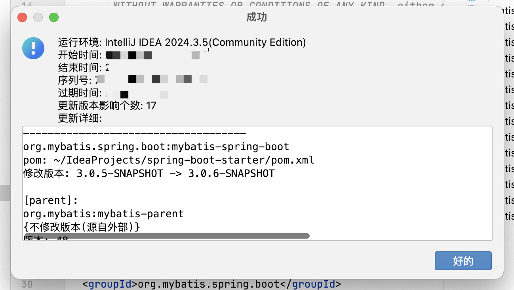
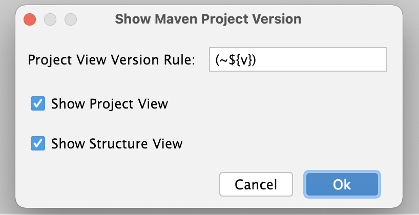

# MPVP(maven)

Maven项目版本插件，可用于版本快速傻瓜式升级及项目版本展示.  
Maven Project Version Plugin, Support Quick Update Version And Show Project Version.

## 特性

### Maven项目版本更新

+ 默认策略

必须存在新版本并且变更版本.  

当版本存在且匹配时将会替换；并且支持依赖版本是特殊值 (e.g: ${version} / [1.6, 1.8]) 将会跳过替换.（依赖中使用项目版本占位符的会跳过替换，但会修改对应的变量属性版本值；如果依赖中使用的是版本范围的将不做处理）  

+ 常规策略

必须存在新版本. 

当版本存在并且匹配时将替换. （即将依赖中的版本替换为当前要应用的新版本） 

+ 其他

#### 支持必须同一版本 (变更前)

选中: 当前要进行设置的项目或依赖的版本如果不等于更改之前的版本时将会跳过替换为新版本.

未选中: 新版本将会直接进行替换.

#### 快照版 (1.3+版本以上支持)

选中：如果新版本输入框的文本值是快照版（以-SNAPSHOT结尾，不区分大小写）则直接作为新版本，反之则以新版本输入框的文本值拼接-SNAPSHOT作为新版本.

未选中: 新版本输入框的文本值直接作为新版本.

### Maven项目版本显示

+ 项目视图展示

+ 结构视图展示

### 国际化支持

支持英文、中文、简体中文（中国）及中文（台湾）

### 如何激活

搜索微信公众号 <a style="color: rgb(255, 76, 65);" href="https://mp.weixin.qq.com/mp/profile_ext?action=home&__biz=MzkyODk0MTA1MA==&scene=124#wechat_redirect" target="_blank">“新程快咖员”</a> 根据菜单链接进行操作

### 使用视频分享
[【使用IDEA插件MPVP(Maven)进行多模块的更新及显示版本】](https://www.bilibili.com/video/BV18QoLYkEjD?vd_source=05374f268767300c92677818cbbdf95d)

## 群组 Group
欢迎加qq群550996296进行交流 ~  
