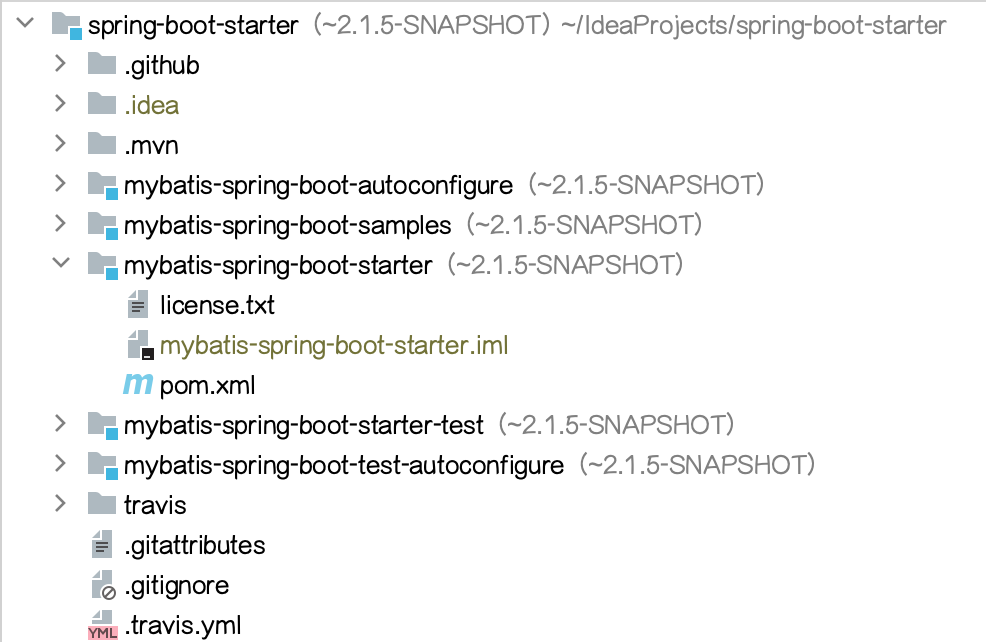

# MPVP(maven) - Maven Project Version Plugin

中文 / [English](README_en.md)


[](https://plugins.jetbrains.com/plugin/24176-mpvp-maven-)

Maven项目版本插件，可用于版本快速傻瓜式升级及项目版本展示和项目版本搜索.
<br/>
Maven Project Version Plugin, Support Quick Update Version And Show Project Version And Search Project Version.

## 如何找到操作菜单？

Tools > Maven Project Version


## 特性

### Maven项目版本更新

无论是快照版还是release版，输入后提交一键轻松帮您搞定版本值升级或回退（再也不用头疼和花费大量时间调整版本值啦）。还会为您展示修改的具体细节~ 简化您的工作流程，为您节省大量宝贵时间！

<b>注：</b>

首先建议大家在修改版本时一定要使用版本管理工具（备份），无论是否使用这款插件进行版本更改，都可以在出现问题时进行快速恢复或回滚！！！

该功能依赖idea读取的Maven数据，如您的pom发生了变更，需要先刷新完成后再使用该功能。

<span style="color: #cb1414;">
如果您是首次使用，建议您先使用<b>版本管理工具（备份）</b>验证插件是否完美契合自己的项目场景（参考上条）。<br/><br/>
当该功能发生<b>重大调整时(25.06.01日起后续版本)</b>（会先尝试发布插件为 “xxx-beat” 的版本）并在操作界面展示<b>功能更新标识（含更新日期）</b>。您此时在<b>升级版本后若发现功能更新标识变更，为了保证升级后的功能符合预期需要您再次重新验证</b>以免对您造成困扰。如果发现存在问题您可进行上报和先临时回退使用变更前的版本。<br/>
</span>
<br/>

<span style="color: rgb(255, 76, 65);">
如果遇到自己的项目不支持（可能是特殊场景），烦请上报示例（需脱敏），让我们一起进一步完善插件~ 
</span>


+ 默认策略 （推荐）

必须存在新版本并且变更版本. <br/>

当版本存在且匹配时将会替换；并且支持依赖版本是特殊值 (e.g: ${version} / [1.6, 1.8]) 将会跳过替换.（依赖中使用项目版本占位符的会跳过替换，但会修改对应的变量属性版本值；如果依赖中使用的是版本范围的将不做处理） <br/>

+ 常规策略

必须存在新版本.<br/>

当版本存在并且匹配时将替换. （即将依赖中的版本替换为当前要应用的新版本）<br/>

+ 其他

#### 支持必须同一版本 (变更前)

选中: 当前要进行设置的项目或依赖的版本如果不等于更改之前的版本时将会跳过替换为新版本.

未选中: 新版本将会直接进行替换.

#### 快照版

选中：如果新版本输入框的文本值是快照版（以-SNAPSHOT结尾，不区分大小写）则直接作为新版本，反之则以新版本输入框的文本值拼接-SNAPSHOT作为新版本.

未选中: 新版本输入框的文本值直接作为新版本.


### Maven项目版本显示

可直接在项目视图中展示版本值，一眼便能知晓当下版本~ 并提供自定义展示规则能力（其中${v}为固定版本值表达式）。


#### 项目视图展示



#### 结构视图展示


### Maven项目版本搜索

支持查询中央仓库最新依赖版本，也可以快速查询Nexus仓库(远程/私服)依赖版本。 

提供便捷式搜索能力(Maven pom配置或Gradle依赖配置粘贴后即可查询，也可通过关键字进行查询)，
一键复制依赖坐标，快速查看版本详情页等，欢迎上手体验~ 

简化您的工作流程，为您节省大量宝贵时间！(持续更新优化！欢迎提供优化建议~)

#### 中央仓库


#### Nexus仓库 (远程/私服)


### 国际化支持

支持英文、中文、简体中文（中国）及中文（台湾）

## 其他

### conf.properties配置文件 

可用于进行个性化项的配置

+ 全局配置: 用户主目录/mpvp/conf.properties

+ 项目配置: 用户项目工作目录/.idea/mpvp/conf.properties (优先级最高)

支持配置如下：

```
# 自定义使用语言
#my.language=zh_CN

# pom-path是否进行转换
format.pom-path.prettify=true

# pom-path中替换用户主目录的字符串
format.pom-path.user.home.str=~

# 序列号是否脱敏
sensitive-data.machine_serial_numbers=true

# 搜索nexus3查看远程仓库使用新url (配置值存在多个时用,分割) -- 2.1.x新增
#search.nx3.repository-version-use-new-url=http://localhost:8081/
#search.nx3.repository-version-use-new-url=http://localhost:8081/,http://localhost:8083/

# 搜索nexus缓存保存周期（单位：分钟，配置值应 > 0，未配置或不合法时使用默认值 360）-- 2.1.x新增
#search.nx.cache-save-period=360

```

### 系统内置语言

+ zh         中文
+ zh_CN      简体中文（中国）
+ zh_TW      中文（台湾）
+ en         英文

#### 如何指定当前使用的语言？

可通过系统默认语言，也可在conf.properties中进行指定要使用的语言


## 如何激活？

搜索微信公众号 <a style="color: rgb(255, 76, 65);" href="https://mp.weixin.qq.com/mp/profile_ext?action=home&__biz=MzkyODk0MTA1MA==&scene=124#wechat_redirect" target="_blank">“新程快咖员”</a>（<a href="https://mp.weixin.qq.com/mp/qrcode?scene=10000004&size=102&__biz=MzkyODk0MTA1MA==&mid=2247483700&idx=1&sn=2a00414552461b2235b1d4b5b6878f16&send_time=" target="_blank">点击查看二维码</a>）根据菜单链接进行操作

<span style="color: red">注：</span>如有问题，您可直接在公众号发送消息进行留言

## 使用视频分享

[【使用IDEA插件MPVP(Maven)进行多模块的更新及显示版本】](https://www.bilibili.com/video/BV18QoLYkEjD?vd_source=05374f268767300c92677818cbbdf95d)


## 联系我们

如果您有任何问题或建议，可以通过以下方式：

+ 提交 [Github Issues](https://github.com/joker-pper/intellij-mpvp-maven/issues)

+ QQ交流群: [550996296](http://qm.qq.com/cgi-bin/qm/qr?_wv=1027&k=50F30oecs4iVEfMBlRK4fhfLIzLlV6-t&authKey=i%2BrfuFb1IrbqEmE3QT5GCOF75A0LXsoriZN9951IbY7eezZpoQgvskOkK513z2Bf&noverify=0&group_code=550996296)

+ Email: [yyc_xincheng@163.com](mailto:yyc_xincheng@163.com)

