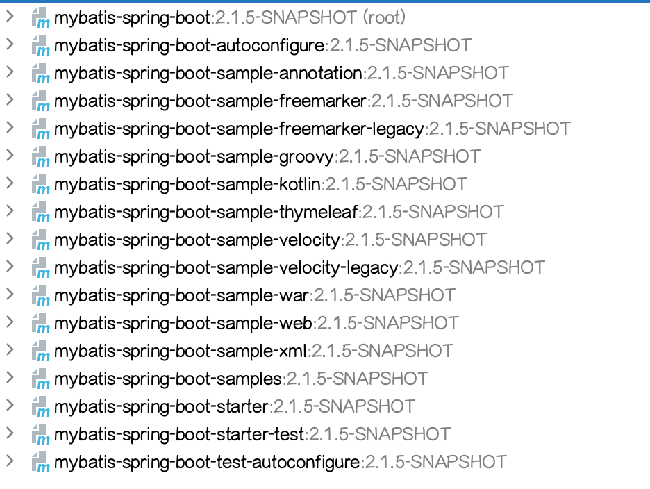
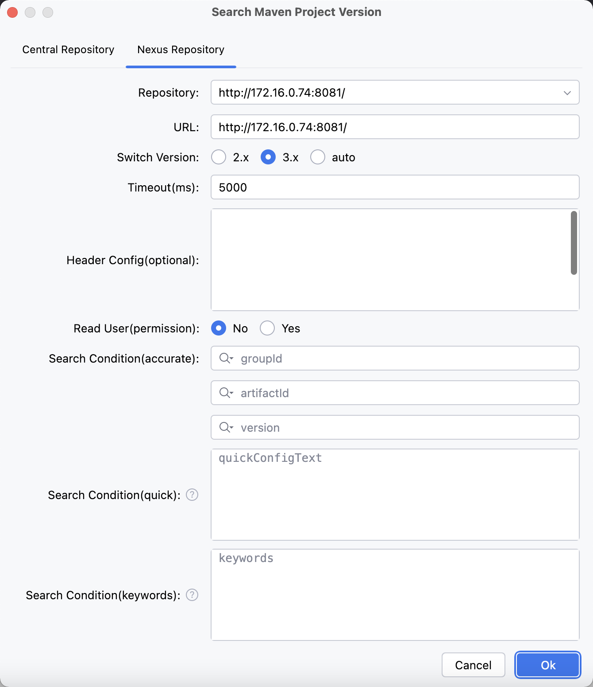
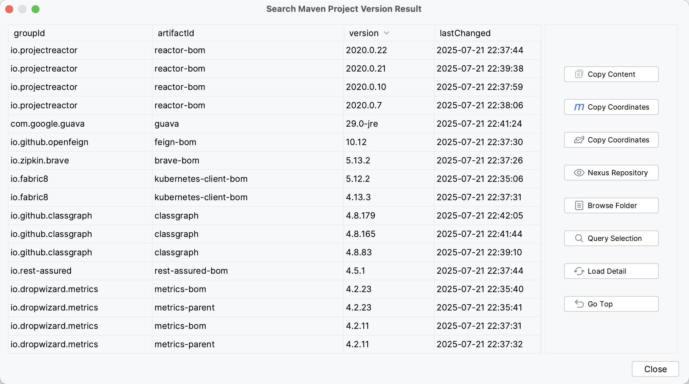

# Maven With Me(MPVP) - Maven Project Version Plugin

[](https://plugins.jetbrains.com/plugin/27647-maven-with-me-mpvp-)
[%20downloads&labelColor=5d3623&color=green)](https://plugins.jetbrains.com/plugin/24176-mpvp-maven-)
[](./README.md)
[](./README_en.md)
[](https://joker-pper.github.io/intellij-mpvp-maven/)
[](docs/LICENSE_Page.md)

<div align="center" style="text-align: center;">
    
</div>

Maven项目版本插件，可用于版本快速傻瓜式升级及项目版本展示和项目版本搜索并支持快速生成常见项目版本的徽章.
<br/>
<br/>
Maven Project Version Plugin, Support Quick Update Version And Show Project Version And Search Project Version And Quick Generate Badges For Common Project Version.

<hr/>

<p style="font-size: 20px; font-weight: bold; color:red;">
Welcome everyone to join the communication group, not only can you get the latest plugin resources in the first time, but you can also communicate and learn together!
</p>

WeChat communication group: On the WeChat official account <a style="color: rgb(255, 76, 65);" href="https://mp.weixin.qq.com/mp/profile_ext?action=home&__biz=MzkyODk0MTA1MA==&scene=124#wechat_redirect" target="_blank">“新程快咖员”</a> (<a href="https://mp.weixin.qq.com/mp/qrcode?scene=10000004&size=102&__biz=MzkyODk0MTA1MA==&mid=2247483700&idx=1&sn=2a00414552461b2235b1d4b5b6878f16&send_time=" target="_blank">Click to view QR code</a>) Leave a message <span style="color: rgb(255, 76, 65);">"WeChat group"</span> to get it

QQ communication group: [550996296 (Click to add to group)](http://qm.qq.com/cgi-bin/qm/qr?_wv=1027&k=50F30oecs4iVEfMBlRK4fhfLIzLlV6-t&authKey=i%2BrfuFb1IrbqEmE3QT5GCOF75A0LXsoriZN9951IbY7eezZpoQgvskOkK513z2Bf&noverify=0&group_code=550996296)

<hr/>


<p style="font-size: 15px; font-weight: bold;">
The plugin "MPVP(Maven)" has been changed to <span  style="color: rgb(255, 76, 65);">"Maven With Me(MPVP)"</span> plugin, and "MPVP(Maven)" will no longer be maintained in the future.

We suggest that you uninstall the currently installed "MPVP(Maven)" plugin (which may conflict with the "Maven With Me(MPVP)" plugin) and search for the keywords <span  style="color: rgb(255, 76, 65);">"MPVP"</span> in the plugin marketplace to switch to <span  style="color: rgb(255, 76, 65);">"Maven With Me(MPVP)"</span> plugin.
</p>

<hr/>

> Subdivision plugin

[](https://plugins.jetbrains.com/plugin/27628-maven-update-mpvp-)
[](https://plugins.jetbrains.com/plugin/27627-maven-search-mpvp-)

<hr/>

## Preface

工欲善其事必先利其器！想必大家在使用maven时会经常碰到项目版本升级和依赖版本升级的问题吧。针对占用大家大量时间以及大家经常使用遇到的痛点，这款插件诞生了！！！
轻松帮您解决搜索依赖困扰和升级版本困扰！ 轻便快捷是初心，势必为节省您的大量时间和心力而前行！让更多的时间和价值留在更重要的地方！！！<br/>
<b>希望它能成为一款真正有价值的插件，避免大家花费更多的精力和心力在这些繁琐的流程中。当然这也需要您的支持，以便我们提供更好的服务和迭代，利他和利己不是可以共存的嘛~ 让我们一起走得更远！</b><br/>

To do a good job, one must first sharpen their tools! I believe everyone often encounters issues with project version upgrades and dependency version upgrades when using Maven. This plugin has been born to address the pain points that consume a lot of everyone's time and are frequently encountered during use!!!
Easily help you solve search dependency and upgrade version problems! Lightweight and fast is our original intention, and we will definitely move forward to save you a lot of time and effort! Let more time and value stay in more important places!!!<br/>
<b>I hope it can become a truly valuable plugin, avoiding everyone from spending more energy and effort on these tedious processes. Of course, this also requires your support so that we can provide better services and iterations. Altruism and self-interest can coexist. Let's go further together!</b><br/>


<hr/>

## Update plan

version: <span style="color: red">2.6.x</span>

expected release time: <span style="color: red">???</span>

details: [click here to go](docs/Next.md)

## Discounted activities (The minimum cost is less than ¥6 per month)

If you need, you can view the details in the WeChat official account menu <span textstyle="" style="color: rgb(255, 76, 0)">MPVP</span>&nbsp;&gt;&nbsp;<span textstyle="" style="color: rgb(255, 76, 0)">激活链接</span> view details<br/><br/>


## Feature comparison

| Feature                  | Trial (unauthorized key)                     |Trial (with authorized key)    | Normal activation                  |
|--------------------------|--------------------------------|----------------|-----------------------|
| **Goods Promotion**      | Unlimited support, hope everyone can support more, it will affect the frequency of publishing trial plugins | Unlimited support, hope everyone can support more, it will affect the frequency of publishing trial plugins | Unlimited support|
| Update Version           | Limited Number of Validity Times (Daily) | Limited Number of Validity Times, Exceeding Unauthorized KEY Times (Daily) | Unlimited Times|
| Show Version             | Unlimited Number of Validity Times (Currently) | Unlimited Number of Validity Times (Currently) | Unlimited Number of Times|
| Search Version           | Limited Number of Validity Times (Daily) | Limited Number of Validity Times, Exceeding Unauthorized KEY Times (Daily) | Unlimited Times|
| Badge Generation         | Unlimited Times (Currently) | Unlimited Times (Currently) | Unlimited Times|
| Restricted usage time period  | Yes (9.00-17.00/9.00-18.00 and others) | None | None|
| Activation validity time | Default setting when plugin is released | Number of days corresponding to applying for trial | Number of days corresponding to applying for activation (currently available as an additional gift, up to 30 days)|


## How to activate it?

Search WeChat official account <a style="color: rgb(255, 76, 65);" href="https://mp.weixin.qq.com/mp/profile_ext?action=home&__biz=MzkyODk0MTA1MA==&scene=124#wechat_redirect" target="_blank">“新程快咖员”</a> (<a href="https://mp.weixin.qq.com/mp/qrcode?scene=10000004&size=102&__biz=MzkyODk0MTA1MA==&mid=2247483700&idx=1&sn=2a00414552461b2235b1d4b5b6878f16&send_time=" target="_blank">Click to view QR code</a>) Operate according to the menu link(<span style="color: rgb(255, 76, 65);">During normal activation, the remaining trial days of the plugin release can be stacked! No need to wait for the plugin trial to expire!</span>)

<span style="color: red">Note: </span>If there is any problem, you can send a message directly on the WeChat official account to leave a message

In addition to testing the plugin directly after its release, you can also apply for a free trial! Just follow the instructions on the WeChat official account.


## How to find the operation menu?

Tools > Maven Project Version


## Features

### Maven Project Version Update

Whether it's a snapshot version or a release version, simply input and submit with one click to easily help you upgrade or roll back version values (no longer have to worry and spend a lot of time adjusting version values). We will also show you the specific details of the modifications~Simplify your workflow and save you a lot of valuable time!

<b>Note:</b>

Firstly, it is recommended that everyone use a version management tool (backup) when modifying versions. Whether or not this plugin is used for version changes, quick recovery or rollback can be performed in case of problems!!!

This feature relies on Maven data read by Idea. If your POM has changed, you need to refresh it before using this feature.

<span style="color: #cb1414;">
If you are using it for the first time, we recommend that you first use the <b>version management tool (backup)</b> to verify whether the plugin is perfectly compatible with your project scenario (refer to the previous prompt). <br/><br/>
When there is a major adjustment to this feature (in subsequent versions starting from 25.06.01), we will first attempt to release a version with the plugin "xxx-beat" and display the feature update identifier (including the update date) on the user interface. If you find that the feature update identifier has changed after upgrading the version, you will need to re verify it again to ensure that the upgraded feature meets expectations and avoid any inconvenience. 
If you find any problems, you can report them and temporarily revert back to the version before the change. <br/>
</span>
<br/>

<span style="color: rgb(255, 76, 65);">
If you encounter a situation where your project does not support it (possibly in a special scenario), please provide an example (desensitized) so that we can further improve the plugin together~
</span>
<br/>
<br/>


+ Default Strategy (recommend)

must have new version and changed version. <br/>

when version exist and matched will replace and support dependency version is special value (e.g: ${version} / [1.6, 1.8]) will continue replace.(If project version placeholders are used in dependencies, replacement will be skipped, but the corresponding variable property version value will be modified; if version range placeholders are used in dependencies, no processing will be done.) <br/>

+ General Strategy

must have new version.<br/>

when version exist and matched will replace. (Replace the version in the dependency with the new version to be applied) <br/>

+ Other

#### Support Must Same Version (Before)

If Checked: project or dependency version not equals project before replacement version will continue replace. <br/>

If Not Checked: new version will to replace.

#### Support Snapshot Version

If Checked: If the text value of the new version input box is a snapshot version (ending with -SNAPSHOT, case insensitive), it is directly considered as the new version. Otherwise, the text value of the new version input box is concatenated with -SNAPSHOT as the new version. <br/>

If Not Checked: The text value in the new version input box is directly used as the new version.


### Maven Project Version Show

You can directly display version values in the project view, knowing the current version at a glance and providing the ability to customize display rules (the ${v} is a fixed version value expression).


#### project view


#### structure view



### Maven Project Version Search

Support querying the latest dependency versions of the Central Repository, as well as quickly querying the dependency versions of the Nexus Repository (remote/private). Simplify your workflow and save you a lot of valuable time! Welcome to experience it~

Provide convenient search capabilities (Maven pom configuration or Gradle dependency configuration can be querying after pasting, or querying by keywords)

One click copying of dependency coordinates

<span style="color: rgb(255, 76, 65);">One click access to file directory (compatible with lower versions of Nexus)</span>

<span style="color: rgb(255, 76, 65);">One click loading update time (compatible with lower versions of Nexus)</span>

Quickly viewing of version detail pages

Nexus repository query increases cache (memory level) to reduce query detail requests within a certain period of time. The default user level Nexus repository cache time is 1 minute for snapshot and 30 minutes for release, and configurable parameter adjustments are provided (minimum value is 1 minute, maximum value is 360 minutes)

...

(Continuously updated and optimized! Welcome to provide optimization suggestions~)

#### Central Repository


#### Nexus Repository (remote/private)






### Maven Project Version Badge

Supports the quick generate badges for common Maven project versions (relying on the capabilities of shields.io).

Provides common parameter usage, allowing quick customization of text and color

Add an internal @alt parameter to define the text for the alt attribute in HTML, Markdown, and Markdown (With URL)

Provide URL, Markdown, Markdown (With URL), HTML build types

Provide the ability to quickly enter groupId and artifactId (e.g: by pasting Maven pom configuration or Gradle dependency configuration)

Markdown (with URL) provides built-in Redirect links by default, and you can also customize and enter Redirect links


### Internationalization Support

Supports English, Chinese, Simplified Chinese (China), and Chinese (Taiwan)

## Other

### conf.properties

Can be used for configuring personalized items

+ global configuration: user home/mpvp/conf.properties

+ project configuration: user project work dir/.idea/mpvp/conf.properties (Highest priority)


The supported configurations are as follows:

```
# customize language usage
#my.language=zh_CN
#my.language=zh_TW
#my.language=en

# pom-path format to prettify?
format.pom-path.prettify=true

# pom-path format to replace the string of the user home 
format.pom-path.user.home.str=~

# machine serial numbers to desensitize?
sensitive-data.machine_serial_numbers=true

# search for Nexus3.x to view new url for remote repository version usage (when there are multiple values use , split) -- 2.1.x added
#search.nx3.repository-version-use-new-url=http://localhost:8081/
#search.nx3.repository-version-use-new-url=http://localhost:8081/,http://localhost:8083/

# search nexus cache save period (Unit: minutes, value should be > 0, use default value 360 when not configured or illegal)-- 2.1.x added
#search.nx.cache-save-period=360

# user's private nexus server release query result cache period, and 30 minutes by default when not configured (Unit: minutes, value should be > 0 and <= 360. When not configured or < 1, use default value; when value > maximum value, use default maximum value)
search.user-repository-search-result.release-cache-period=30

# user's private nexus server snapshots query result cache period, and 1 minutes by default when not configured（Unit: minutes, value should be > 0 and <= 360. When not configured or < 1, use default value; when value > maximum value, use default maximum value)
search.user-repository-search-result.snapshots-cache-period=1

# Copy Gradle coordinates in Kotlin format, default to false if not configured
#gradle-coordinate-copy-with-kotlin=false

```

### Internal System Language

+ zh         Chinese
+ zh_CN      Simplified Chinese（China）
+ zh_TW      Chinese（Taiwan）
+ en         English

#### How to Specify The Current Used Language?

You can use the default language of the system or specify the language to be used in conf. properties


## How to configure Nexus access permissions?

[How to configure Nexus access permissions for IDEA plugin Maven With Me / Maven Search?](docs/how-to-configure-nexus-access-permissions_en.md)


## Use video sharing

[Using IDEA plugin MPVP(Maven) for multi module updates and version show](https://www.bilibili.com/video/BV18QoLYkEjD?vd_source=05374f268767300c92677818cbbdf95d)


## Contact Us

If you have any questions or suggestions, you can do so through the following methods:

Submit [Github Issues](https://github.com/joker-pper/intellij-mpvp-maven/issues)
<br/>
<br/>
QQ communication group: [550996296 (Click to add to group)](http://qm.qq.com/cgi-bin/qm/qr?_wv=1027&k=50F30oecs4iVEfMBlRK4fhfLIzLlV6-t&authKey=i%2BrfuFb1IrbqEmE3QT5GCOF75A0LXsoriZN9951IbY7eezZpoQgvskOkK513z2Bf&noverify=0&group_code=550996296)
<br/>
<br/>
WeChat communication group: On the WeChat official account <a style="color: rgb(255, 76, 65);" href="https://mp.weixin.qq.com/mp/profile_ext?action=home&__biz=MzkyODk0MTA1MA==&scene=124#wechat_redirect" target="_blank">“新程快咖员”</a> (<a href="https://mp.weixin.qq.com/mp/qrcode?scene=10000004&size=102&__biz=MzkyODk0MTA1MA==&mid=2247483700&idx=1&sn=2a00414552461b2235b1d4b5b6878f16&send_time=" target="_blank">Click to view QR code</a>) Leave a message <span style="color: rgb(255, 76, 65);">"WeChat group"</span> to get it
<br/>
<br/>
WeChat official account: <a style="color: rgb(255, 76, 65);" href="https://mp.weixin.qq.com/mp/profile_ext?action=home&__biz=MzkyODk0MTA1MA==&scene=124#wechat_redirect" target="_blank">“新程快咖员”</a> (<a href="https://mp.weixin.qq.com/mp/qrcode?scene=10000004&size=102&__biz=MzkyODk0MTA1MA==&mid=2247483700&idx=1&sn=2a00414552461b2235b1d4b5b6878f16&send_time=" target="_blank">Click to view QR code</a>)
<br/>
<br/>
Email: [yyc_xincheng@163.com](mailto:yyc_xincheng@163.com)
<br/>
<br/>

