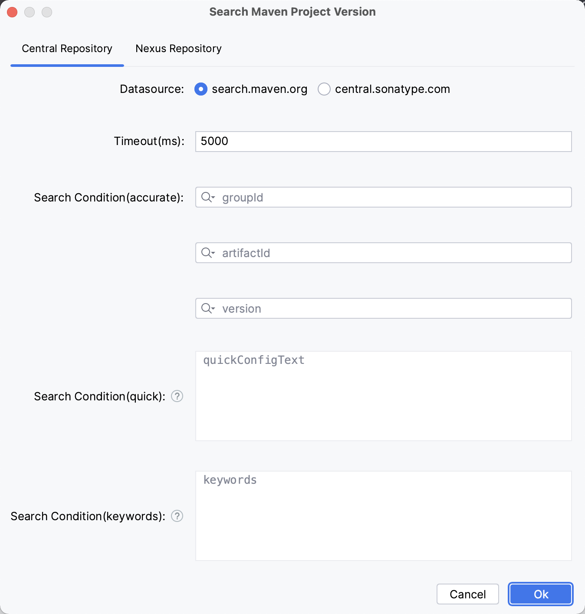
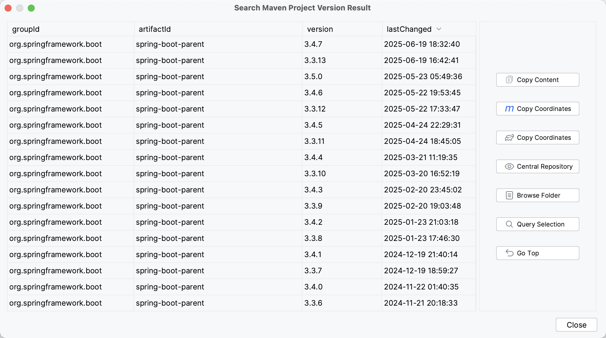

# MPVP(maven) - Maven Project Version Plugin

[中文](README.md) / English


[](https://plugins.jetbrains.com/plugin/24176-mpvp-maven-)

Maven项目版本插件，可用于版本快速傻瓜式升级及项目版本展示和项目版本搜索.
<br/>
Maven Project Version Plugin, Support Quick Update Version And Show Project Version And Search Project Version.

## How to find the operation menu?

Tools > Maven Project Version


## Features

### Maven Project Version Update


+ Default Strategy (recommend)

must have new version and changed version. <br/>

when version exist and matched will replace and support dependency version is special value (e.g: ${version} / [1.6, 1.8]) will continue replace.(If project version placeholders are used in dependencies, replacement will be skipped, but the corresponding variable property version value will be modified; if version range placeholders are used in dependencies, no processing will be done.) <br/>

+ General Strategy

must have new version.<br/>

when version exist and matched will replace. (Replace the version in the dependency with the new version to be applied) <br/>

+ Other

#### Support Must Same Version (Before)

If Checked: project or dependency version not equals project before replacement version will continue replace. <br/>

If Not Checked: new version will to replace.

#### Support Snapshot Version

If Checked: If the text value of the new version input box is a snapshot version (ending with -SNAPSHOT, case insensitive), it is directly considered as the new version. Otherwise, the text value of the new version input box is concatenated with -SNAPSHOT as the new version. <br/>

If Not Checked: The text value in the new version input box is directly used as the new version.


### Maven Project Version Show


+ project view


+ structure view


### Maven Project Version Search

Support version queries for both Central Repository and Nexus Repository (remote/private), including copying coordinates and viewing version detail pages

+ Central Repository





+ Nexus Repository (remote/private)


### Internationalization Support

Supports English, Chinese, Simplified Chinese (China), and Chinese (Taiwan)

## Other

### conf.properties

Can be used for configuring personalized items

+ global configuration: user home/mpvp/conf.properties

+ project configuration: user project work dir/.idea/mpvp/conf.properties (Highest priority)


The supported configurations are as follows:

```
# customize language usage
#my.language=zh_CN

# pom-path format to prettify?
format.pom-path.prettify=true

# pom-path format to replace the string of the user home 
format.pom-path.user.home.str=~

# machine serial numbers to desensitize?
sensitive-data.machine_serial_numbers=true
```

### Internal System Language

+ zh         Chinese
+ zh_CN      Simplified Chinese（China）
+ zh_TW      Chinese（Taiwan）
+ en         English

#### How to Specify The Current Used Language?

You can use the default language of the system or specify the language to be used in conf. properties


## How to activate it?

Search WeChat official account <a style="color: rgb(255, 76, 65);" href="https://mp.weixin.qq.com/mp/profile_ext?action=home&__biz=MzkyODk0MTA1MA==&scene=124#wechat_redirect" target="_blank">“新程快咖员”</a> (<a href="https://mp.weixin.qq.com/mp/qrcode?scene=10000004&size=102&__biz=MzkyODk0MTA1MA==&mid=2247483700&idx=1&sn=2a00414552461b2235b1d4b5b6878f16&send_time=" target="_blank">Click to view QR code</a>) Operate according to the menu link 


## Use video sharing

[Using IDEA plugin MPVP(Maven) for multi module updates and version show](https://www.bilibili.com/video/BV18QoLYkEjD?vd_source=05374f268767300c92677818cbbdf95d)


## Contact Us

If you have any questions or suggestions, you can do so through the following methods:

+ Submit [Github Issues](https://github.com/joker-pper/intellij-mpvp-maven/issues)

+ QQ communication group: [550996296](http://qm.qq.com/cgi-bin/qm/qr?_wv=1027&k=50F30oecs4iVEfMBlRK4fhfLIzLlV6-t&authKey=i%2BrfuFb1IrbqEmE3QT5GCOF75A0LXsoriZN9951IbY7eezZpoQgvskOkK513z2Bf&noverify=0&group_code=550996296)

+ Email: [yyc_xincheng@163.com](mailto:yyc_xincheng@163.com)

