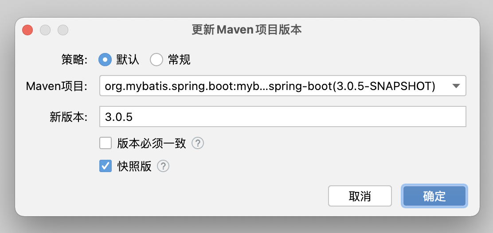
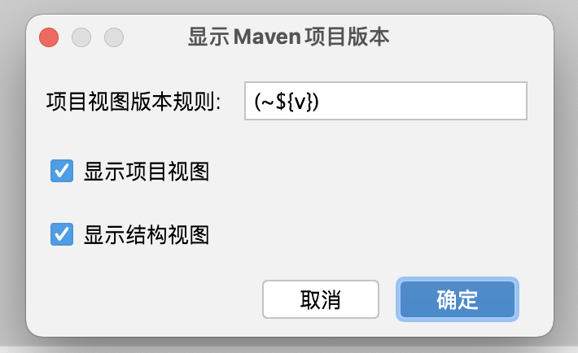
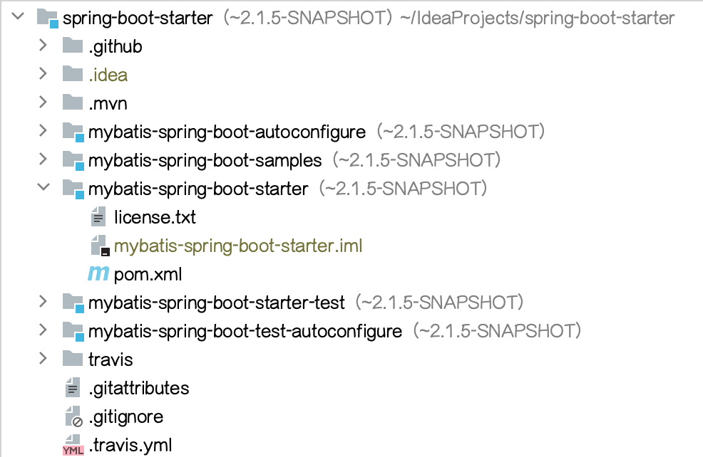
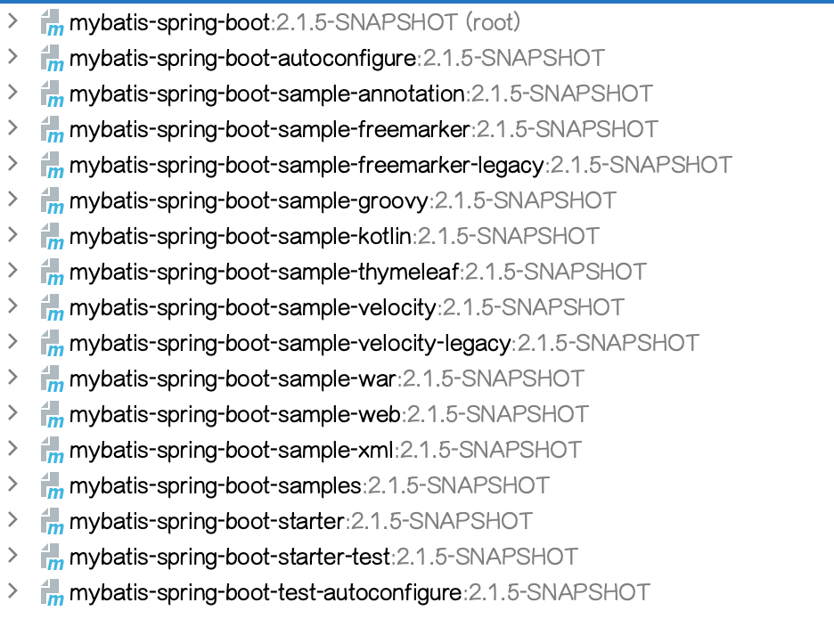
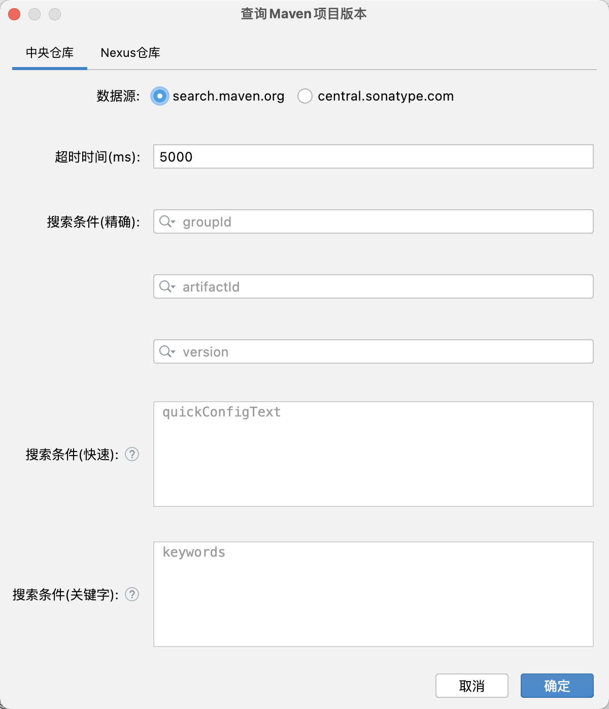
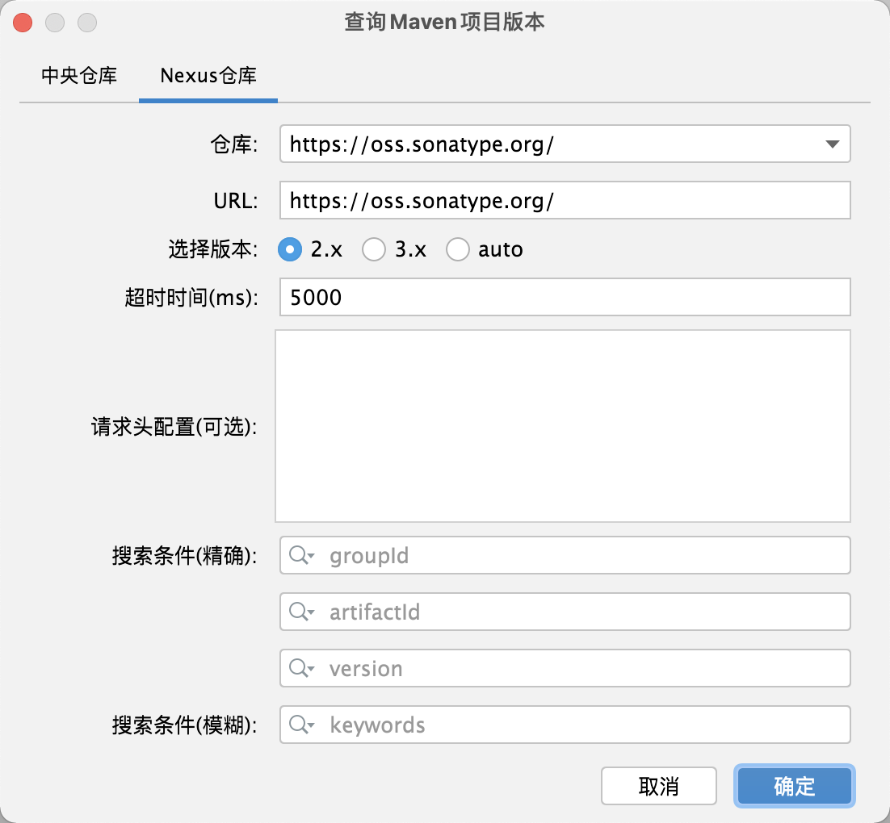
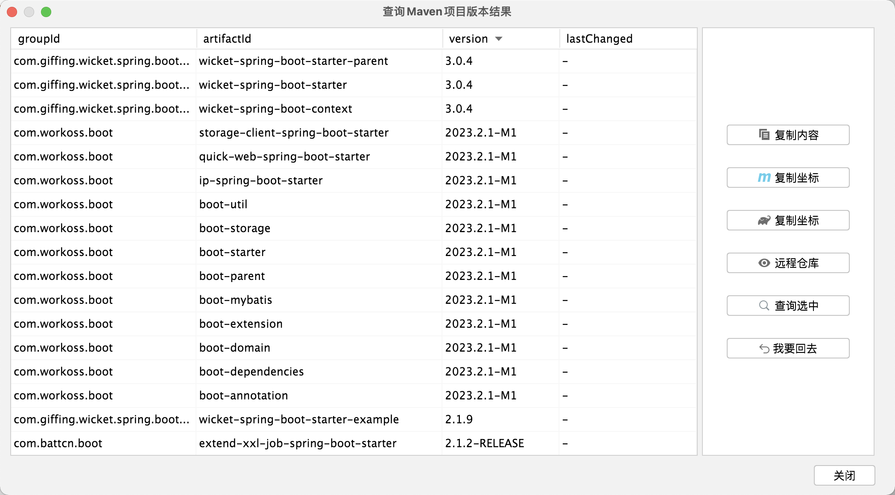
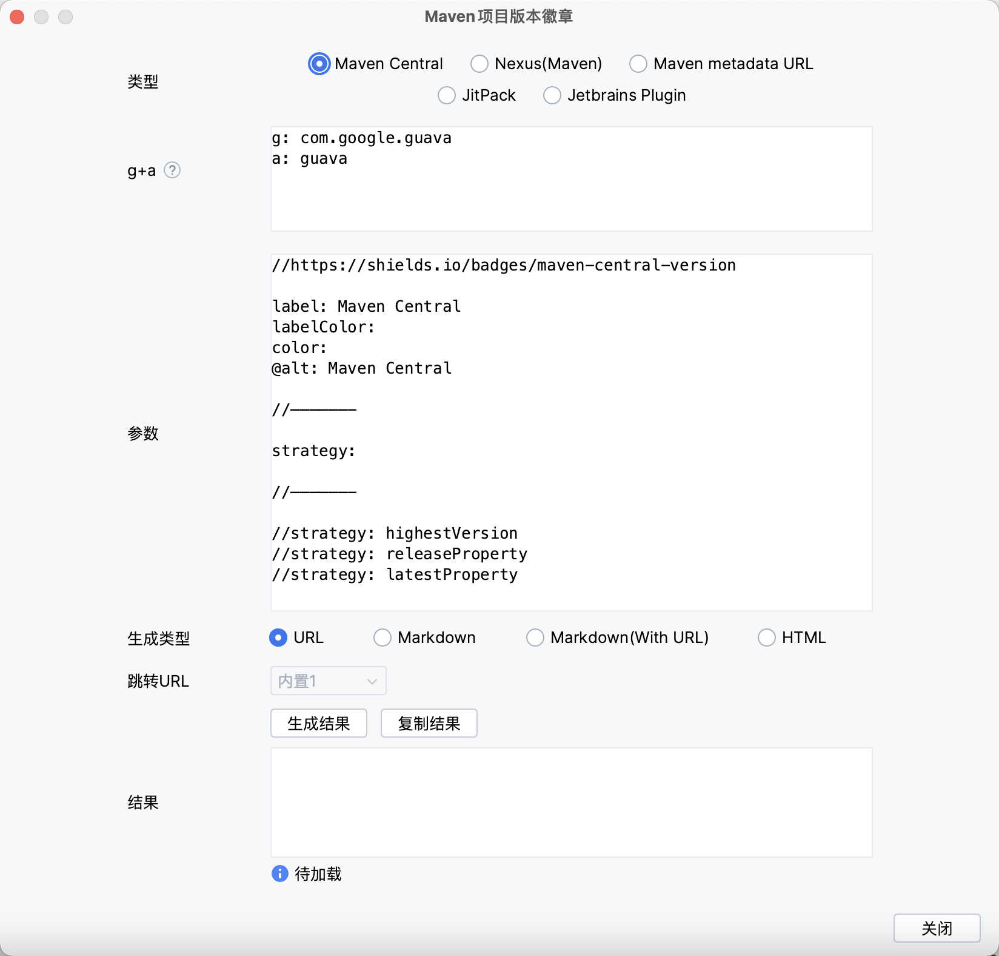
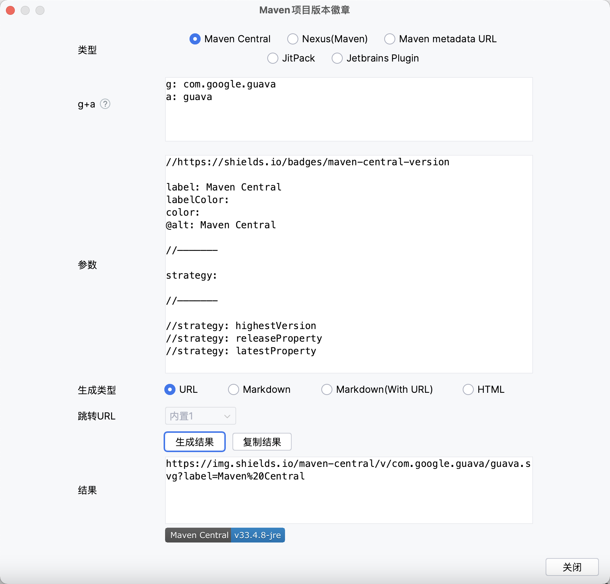

[返回主页](../README.md) 

## 特性详情

### Maven项目版本更新

无论是快照版还是release版，输入后提交一键轻松帮您搞定版本值升级或回退（再也不用头疼和花费大量时间调整版本值啦）。还会为您展示修改的具体细节~ 简化您的工作流程，为您节省大量宝贵时间！

<b>注：</b>

首先建议大家在修改版本时一定要使用版本管理工具（备份），无论是否使用这款插件进行版本更改，都可以在出现问题时进行快速恢复或回滚！！！

该功能依赖idea读取的Maven数据，如您的pom发生了变更，需要先刷新完成后再使用该功能。

如果您是首次使用，建议您先使用<b>版本管理工具（备份）</b>验证插件是否完美契合自己的项目场景（参考上条）。  
当该功能发生<b>重大调整时(25.06.01日起后续版本)</b>（会先尝试发布插件为 “xxx-beat” 的版本）并在操作界面展示<b>功能更新标识（含更新日期）</b>。您此时在<b>升级版本后若发现功能更新标识变更，为了保证升级后的功能符合预期需要您再次重新验证</b>以免对您造成困扰。如果发现存在问题您可进行上报和先临时回退使用变更前的版本。 

 

如果遇到自己的项目不支持（可能是特殊场景），烦请上报示例（需脱敏），让我们一起进一步完善插件~

 
 

+ 默认策略 （推荐）

必须存在新版本并且变更版本.  

当版本存在且匹配时将会替换；并且支持依赖版本是特殊值 (e.g: ${version} / [1.6, 1.8]) 将会跳过替换.（依赖中使用项目版本占位符的会跳过替换，但会修改对应的变量属性版本值；如果依赖中使用的是版本范围的将不做处理）  

+ 常规策略

必须存在新版本. 

当版本存在并且匹配时将替换. （即将依赖中的版本替换为当前要应用的新版本） 

+ 其他

#### 支持必须同一版本 (变更前)

选中: 当前要进行设置的项目或依赖的版本如果不等于更改之前的版本时将会跳过替换为新版本.

未选中: 新版本将会直接进行替换.

#### 快照版

选中：如果新版本输入框的文本值是快照版（以-SNAPSHOT结尾，不区分大小写）则直接作为新版本，反之则以新版本输入框的文本值拼接-SNAPSHOT作为新版本.

未选中: 新版本输入框的文本值直接作为新版本.

### Maven项目版本显示

可直接在项目视图中展示版本值，一眼便能知晓当下版本~ 并提供自定义展示规则能力（其中${v}为固定版本值表达式）。

#### 项目视图展示

#### 结构视图展示

### Maven项目版本搜索

支持查询中央仓库最新依赖版本，也可以快速查询Nexus仓库(远程/私服)依赖版本。 简化您的工作流程，为您节省大量宝贵时间！欢迎上手体验~

提供便捷式搜索能力(Maven pom配置或Gradle依赖配置粘贴后即可查询，也可通过关键字进行查询)

一键复制依赖坐标

一键访问文件目录（兼容Nexus低版本）

一键加载更新时间（兼容Nexus低版本）

快速查看版本详情页

Nexus仓库查询增加缓存（内存级）减少一定时间内的查询详细请求，默认用户级Nexus仓库缓存时效（snapshot为1分钟，release为30分钟），并提供可配置参数项调整（最小值为1分钟，最大值为360分钟）

...

(持续更新优化！欢迎提供优化建议~)

#### 中央仓库

#### Nexus仓库 (远程/私服)

### Maven项目版本徽章

支持快速生成常见Maven项目版本的徽章 (依赖shields.io能力)。

提供常见参数使用，可快速自定义文本及颜色

增加内部@alt参数用于定义HTML、Markdown、Markdown(With URL)中alt属性的文本

提供URL、Markdown、Markdown(With URL)、HTML生成类型

提供支持groupId+artifactId快速输入能力(如Maven pom配置或Gradle依赖配置粘贴即可)

Markdown(With URL)默认提供内置跳转链接，也可自定义输入跳转链接

### 国际化支持

支持英文、中文、简体中文（中国）及中文（台湾）
