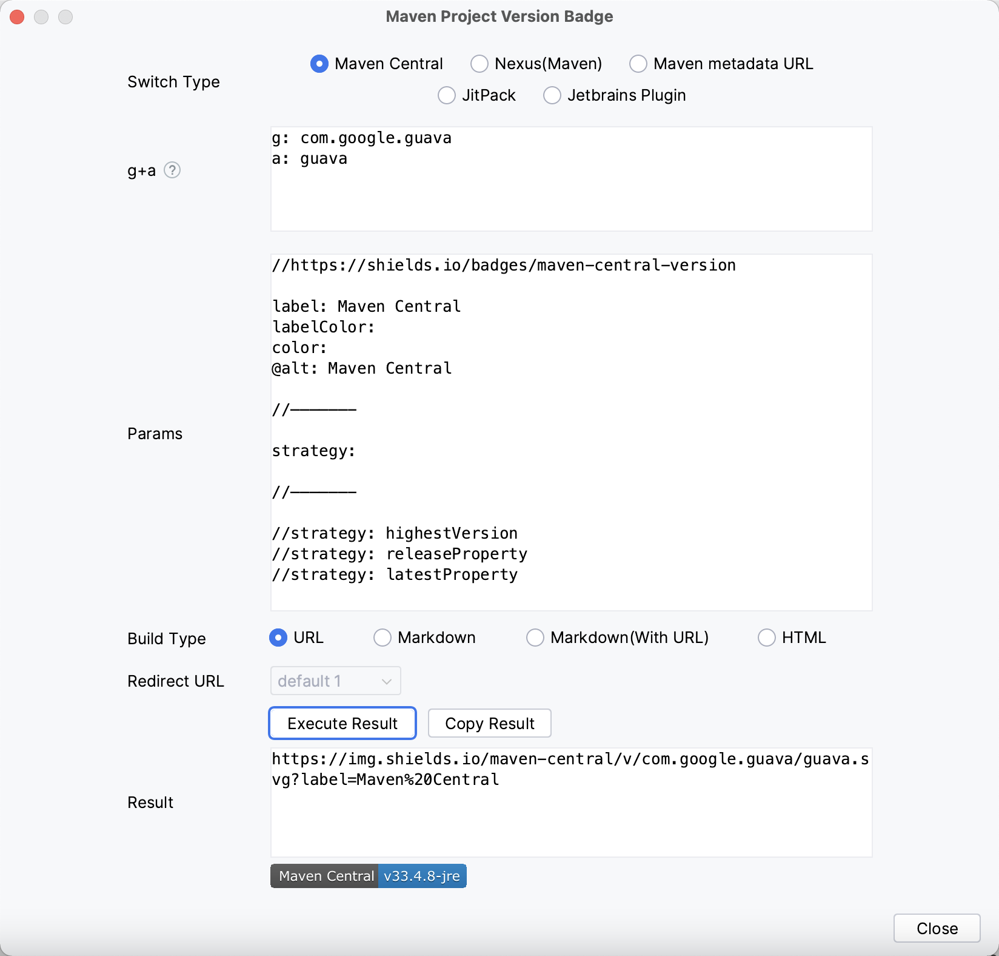

[Go to Homepage](../README_en.md) / [Go to Pro Homepage](../pro/README_en.md)

## Features Detail

### Maven Project Version Update

Whether it's a snapshot version or a release version, simply input and submit with one click to easily help you upgrade or roll back version values (no longer have to worry and spend a lot of time adjusting version values). We will also show you the specific details of the modifications~Simplify your workflow and save you a lot of valuable time!

<b>Note:</b>

Firstly, it is recommended that everyone use a version management tool (backup) when modifying versions. Whether or not this plugin is used for version changes, quick recovery or rollback can be performed in case of problems!!!

This feature relies on Maven data read by Idea. If your POM has changed, you need to refresh it before using this feature.

If you are using it for the first time, we recommend that you first use the <b>version management tool (backup)</b> to verify whether the plugin is perfectly compatible with your project scenario (refer to the previous prompt).   
When there is a major adjustment to this feature (in subsequent versions starting from 25.06.01), we will first attempt to release a version with the plugin "xxx-beat" and display the feature update identifier (including the update date) on the user interface. If you find that the feature update identifier has changed after upgrading the version, you will need to re verify it again to ensure that the upgraded feature meets expectations and avoid any inconvenience. 
If you find any problems, you can report them and temporarily revert back to the version before the change.  

 

If you encounter a situation where your project does not support it (possibly in a special scenario), please provide an example (desensitized) so that we can further improve the plugin together~

 
 

+ Default Strategy (recommend)

must have new version and changed version.  

when version exist and matched will replace and support dependency version is special value (e.g: ${version} / [1.6, 1.8]) will continue replace.(If project version placeholders are used in dependencies, replacement will be skipped, but the corresponding variable property version value will be modified; if version range placeholders are used in dependencies, no processing will be done.)  

+ General Strategy

must have new version. 

when version exist and matched will replace. (Replace the version in the dependency with the new version to be applied)  

+ Other

#### Support Must Same Version (Before)

If Checked: project or dependency version not equals project before replacement version will continue replace.  

If Not Checked: new version will to replace.

#### Support Snapshot Version

If Checked: If the text value of the new version input box is a snapshot version (ending with -SNAPSHOT, case insensitive), it is directly considered as the new version. Otherwise, the text value of the new version input box is concatenated with -SNAPSHOT as the new version.  

If Not Checked: The text value in the new version input box is directly used as the new version.

### Maven Project Version Show

You can directly display version values in the project view, knowing the current version at a glance and providing the ability to customize display rules (the ${v} is a fixed version value expression).

#### project view

#### structure view

### Maven Project Version Search

Support querying the latest dependency versions of the Central Repository, as well as quickly querying the dependency versions of the Nexus Repository (remote/private). Simplify your workflow and save you a lot of valuable time! Welcome to experience it~

Provide convenient search capabilities (Maven pom configuration or Gradle dependency configuration can be querying after pasting, or querying by keywords)

One click copying of dependency coordinates

One click access to file directory (compatible with lower versions of Nexus)

One click loading update time (compatible with lower versions of Nexus)

Quickly viewing of version detail pages

Nexus repository query increases cache (memory level) to reduce query detail requests within a certain period of time. The default user level Nexus repository cache time is 1 minute for snapshot and 30 minutes for release, and configurable parameter adjustments are provided (minimum value is 1 minute, maximum value is 360 minutes)

...

(Continuously updated and optimized! Welcome to provide optimization suggestions~)

#### Central Repository

#### Nexus Repository (remote/private)

### Maven Project Version Badge

Supports the quick generate badges for common Maven project versions (relying on the capabilities of shields.io).

Provides common parameter usage, allowing quick customization of text and color

Add an internal @alt parameter to define the text for the alt attribute in HTML, Markdown, and Markdown (With URL)

Provide URL, Markdown, Markdown (With URL), HTML build types

Provide the ability to quickly enter groupId and artifactId (e.g: by pasting Maven pom configuration or Gradle dependency configuration)

Markdown (with URL) provides built-in Redirect links by default, and you can also customize and enter Redirect links

### Internationalization Support

Supports English, Chinese, Simplified Chinese (China), and Chinese (Taiwan)

