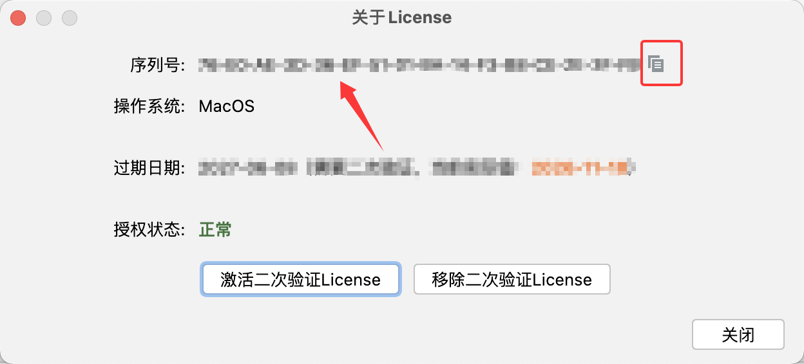
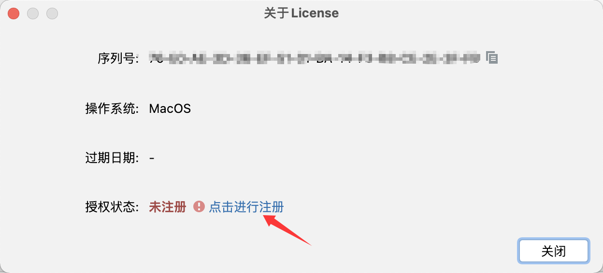
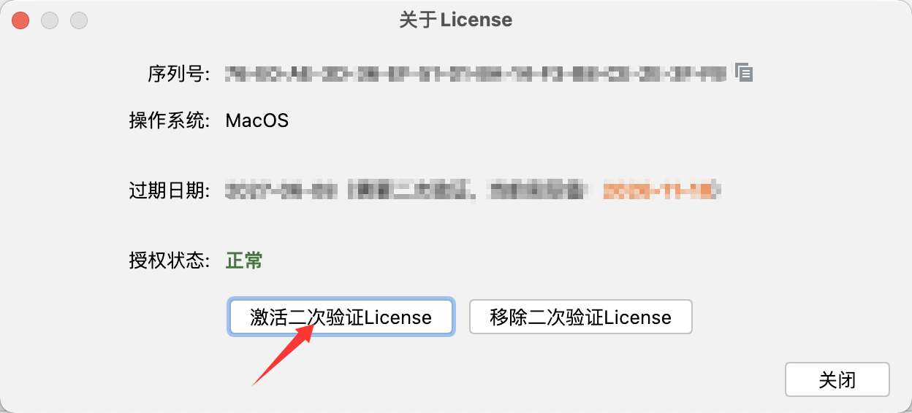
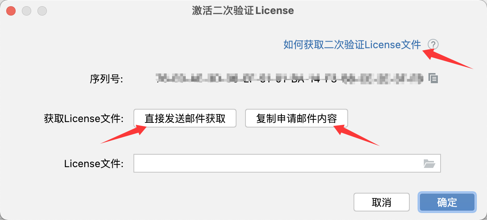
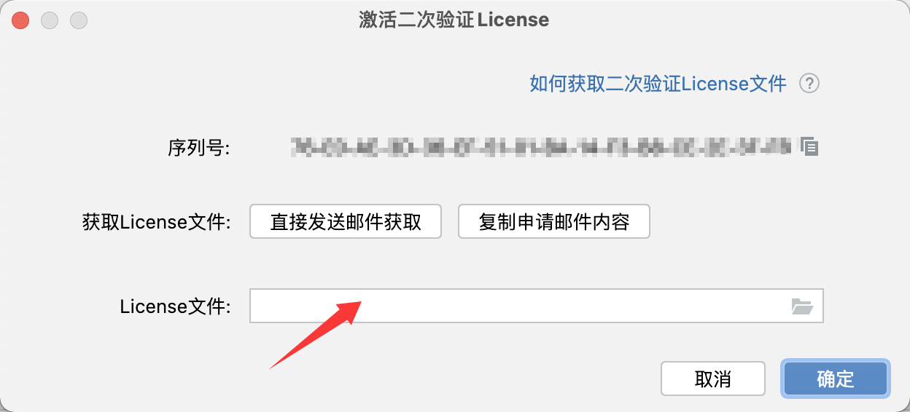

> 
激活说明

[返回主页](../README.md) / [返回Pro主页](../pro/README.md)

***迎新年，行大运~ ㊗️大家新年快乐，马上奔富！***

## ❓ 如何找到操作菜单？

Maven With Me Pro(MPVP)插件:

Tools > Maven Project Version

Maven Update Pro(MPVP)插件:

Tools > Maven Project Version(update)

Maven Search Pro(MPVP)插件:

Tools > Maven Project Version(search)

## ❓ 如何获取序列号？

第一步：打开 **操作菜单**，选择About License菜单

注："操作菜单"在哪里找到？-- 上面栏目/标题《❓ 如何找到操作菜单？》可见详细

第二步：在弹出的对话框中就能找到 序列号  啦，点击右边的  "复制图标"  即可复制序列号到剪贴板~

## ❓ 如何申请试用？ （注：正常激活入口一致）

方式一：

通过插件的最新版找到插件所属 **操作菜单** 的功能项“About License”菜单 > 授权状态项的 “点击进行注册” 链接 跳转IDE进行试用 （以Maven With Me Pro作为示例）

方式二：

在 IDE **Help**菜单 > Manage Subscriptions... 或 IDE **Help**菜单 > Register... 找到对应的插件进行试用

方式三：

访问Pro Edition License 页面进行获取 14-Day Trial

Maven With Me Pro(MPVP)
https://plugins.jetbrains.com/plugin/29269-maven-with-me-pro-mpvp-/pricing?noRedirect=true

Maven Search Pro(MPVP)
https://plugins.jetbrains.com/plugin/29270-maven-search-pro-mpvp-/pricing?noRedirect=true

Maven Update Pro(MPVP)
https://plugins.jetbrains.com/plugin/29271-maven-update-pro-mpvp-/pricing?noRedirect=true

注： 试用时需要正常网络链接（内网可能不支持，您可在个人电脑中先进行试用体验【若项目有严格要求不能复制到个人电脑，请注意红线及使用合规的项目】再决定是否进行内网环境的正式激活）

## ❓ 如何获取二次验证License授权文件？

第一步：正常激活Pro插件

第二步：打开 **操作菜单**，选择About License菜单

注："操作菜单"在哪里找到？-- 上面栏目/标题《❓ 如何找到操作菜单？》可见详细

第三步：在弹出的对话框中点击激活二次验证License按钮，然后在激活二次验证License对话框中通过红色箭头标出的地方进行发送邮件进行获取

## ❓ 获取到二次验证License授权文件后如何使用？

注意事项： 

+ 请核对是否由邮箱 yyc_xincheng@163.com 发送（需关注是否能接收该邮箱的邮件）。 

+ 授权文件是基于 插件 + 序列号进行专属授权，一机一码，不可在其他机器使用。

我们提供了 插件内选择授权文件 的方法进行激活。当然您也可以手动将解压后的KEY文件（如：MPVP-PRO-LICENSE.KEY或MPVP-PRO-LICENSE@XX.KEY）复制到用户目录下的mpvp文件夹下（若不存在mpvp文件夹，需要您进行手动创建）。

采用 **插件内选择授权文件** 的操作如下：

第一步：先进行解压邮箱收到的授权zip文件

第二步：打开 **操作菜单**，选择About License菜单

注："操作菜单"在哪里找到？-- 上面栏目/标题《❓ 如何找到操作菜单？》可见详细

第三步：在弹出的对话框中点击激活二次验证License按钮，然后在激活二次验证License对话框中的**License文件项**进行点击右侧文件图标进行选择License文件或者输入License文件的所在路径，再**点击确定**即可~

