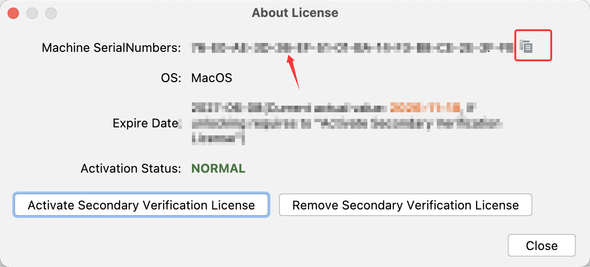
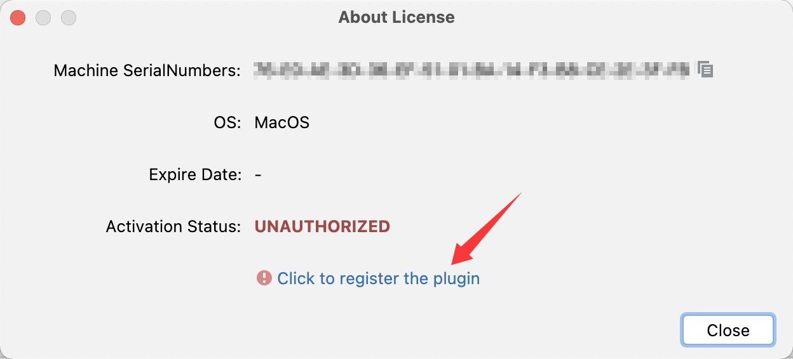
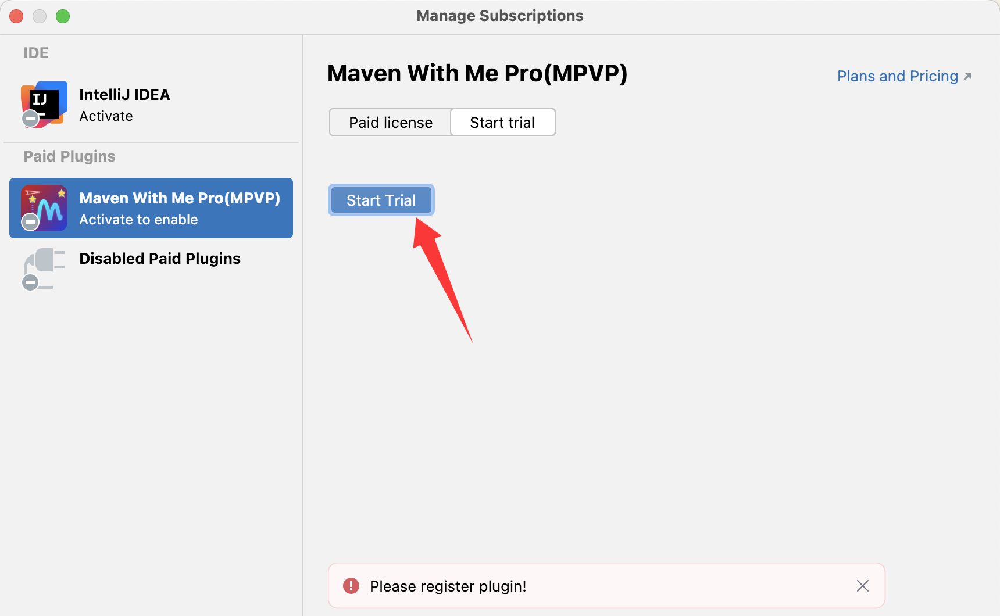
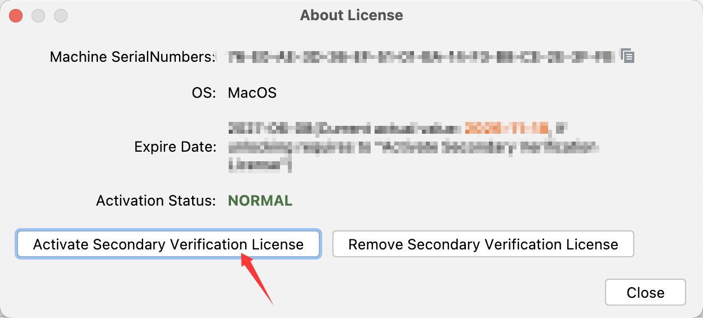
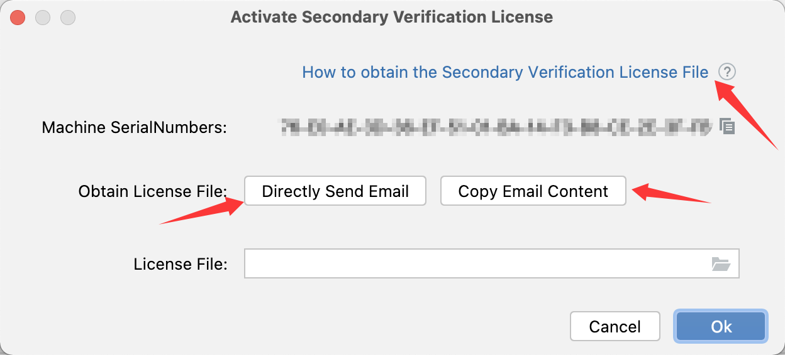
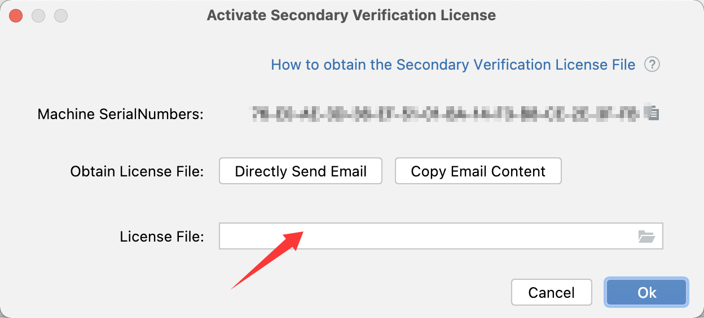

Activation Guide

[Go to Homepage](../README_en.md) / [Go to Pro Homepage](../pro/README_en.md)

***Welcome the New Year, bring on good fortune~ Wishing everyone a Happy New Year and instant wealth!***

## ❓ How to find the operation menu?

Maven With Me Pro(MPVP) plugin:

Tools > Maven Project Version

Maven Update Pro(MPVP) plugin:

Tools > Maven Project Version(update)

Maven Search Pro(MPVP) plugin:

Tools > Maven Project Version(search)

## ❓ How to Get the Machine SerialNumbers?

Step 1: Open the **Operation Menu** and select the About License menu.

Note: Where can the "Operation Menu" be found? -- See the details in the section/title above, "❓ How to find the operation menu?".

Step 2: In the dialog box that pops up, you can find the  Machine SerialNumbers . Click the  "copy icon"  on the right to copy the serial number to the clipboard~

## ❓ How to Apply for a Trial? (Note: The normal activation entry is the same.)

Method 1:

Through the latest version of the plugin, Open the **Operation Menu** and select the About License menu, find "Click to register the plugin"  link in the dialog jump to the IDE and start a trial. (Using Maven With Me Pro as an example.)

Method 2:

In the IDE **Help** menu > Manage Subscriptions... or the IDE **Help** menu > Register..., find the corresponding plugin to start a trial.

Method 3:

Visit the Pro Edition License page to obtain a 14-Day Trial.

Maven With Me Pro(MPVP)

https://plugins.jetbrains.com/plugin/29269-maven-with-me-pro-mpvp-/pricing?noRedirect=true

Maven Search Pro(MPVP)

https://plugins.jetbrains.com/plugin/29270-maven-search-pro-mpvp-/pricing?noRedirect=true

Maven Update Pro(MPVP)

https://plugins.jetbrains.com/plugin/29271-maven-update-pro-mpvp-/pricing?noRedirect=true

Note: A normal network connection is required for the trial (the intranet may not be supported). You can first try the trial on your personal computer [if the project has strict requirements that prevent copying it to a personal computer, please pay attention to the red line and the project's usage compliance] and then decide whether to perform the official activation in the intranet environment.

## ❓ How to Get the Secondary Verification License Authorization File?

Step 1: Activate the Pro plugin normally.

Step 2: Open the **Operation Menu** and select the About License menu.

Note: Where can the "Operation Menu" be found? -- See the details in the section/title above, "❓ How to find the operation menu?".

Step 3: In the dialog, click the Activate Secondary Verification License button, then in the Activate Secondary Verification License dialog box, at the place marked with the red arrow send an email to obtain it.

## ❓ How to Use the Secondary Verification License Authorization File After Obtaining It?

Notes:

+ Please verify that it was sent from the mailbox yyc_xincheng@163.com (pay attention to whether you can receive emails from this mailbox).

+ The authorization file is exclusively authorized based on the plugin + Machine SerialNumbers, one machine one code, and cannot be used on other machines.

We provide the select the authorization file within the plugin method for activation. Of course, you can also manually copy the extracted KEY file (e.g., MPVP-PRO-LICENSE.KEY or MPVP-PRO-LICENSE@XX.KEY) to the mpvp folder under the user directory (if the mpvp folder does not exist, you need to create it manually).

The operation of **selecting the authorization file within the plugin** is as follows:

Step 1: First extract the authorization zip file received in the mailbox.

Step 2: Open the **Operation Menu** and select the About License menu.

Note: Where can the "Operation Menu" be found? -- See the details in the section/title above, "❓ How to find the operation menu?".

Step 3: In the dialog box that pops up, click the Activate Secondary Verification License button, then in the **License File item** of the Activate Secondary Verification License dialog box, click the **file icon on the right** to select the License file or enter the path where the License file is located, then click **OK** button~

