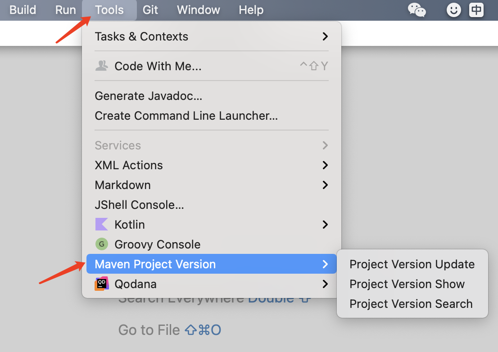
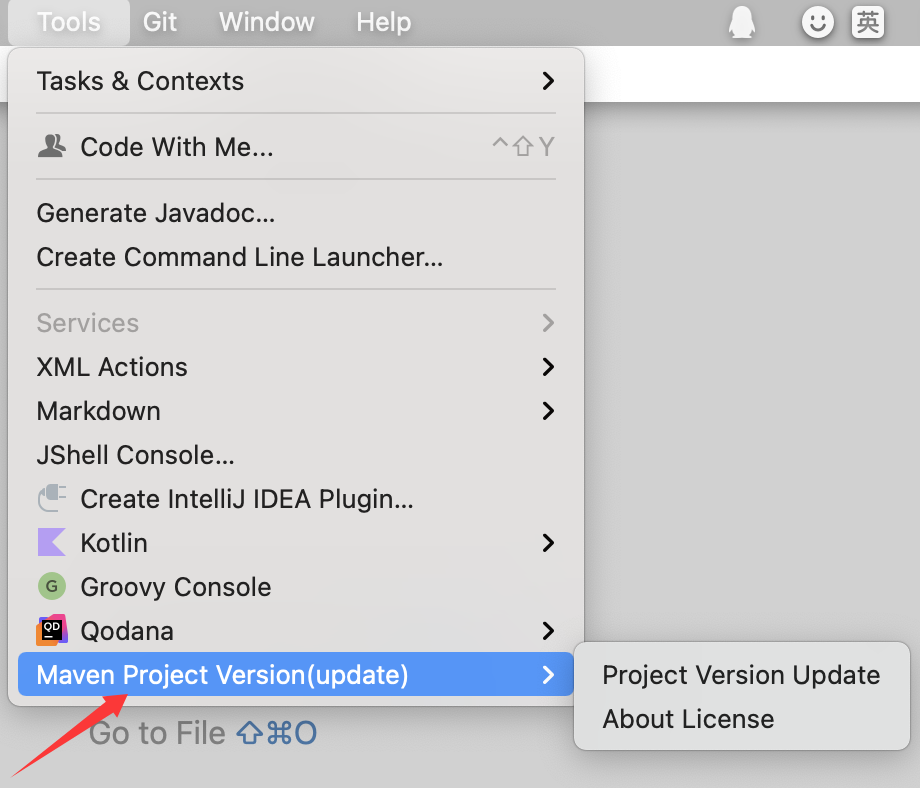
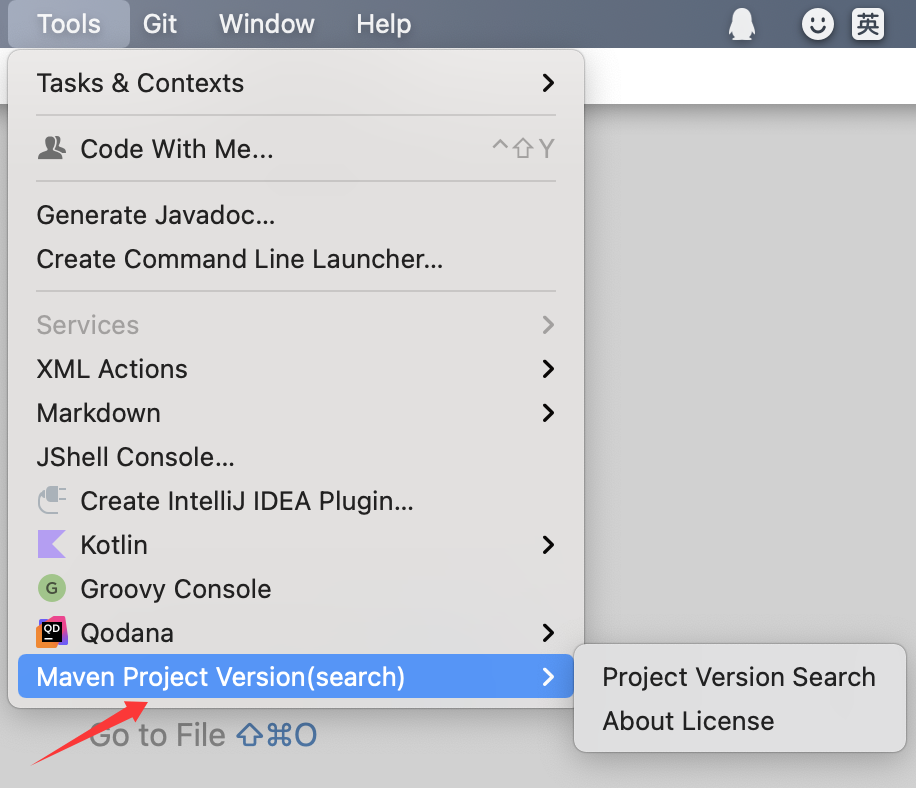
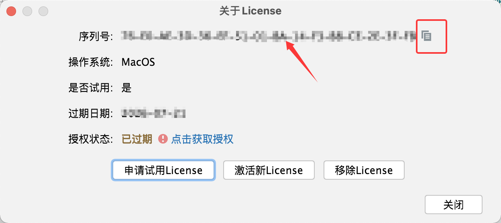
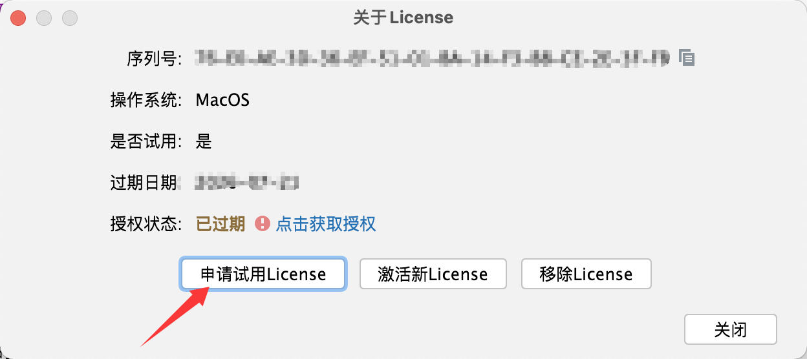
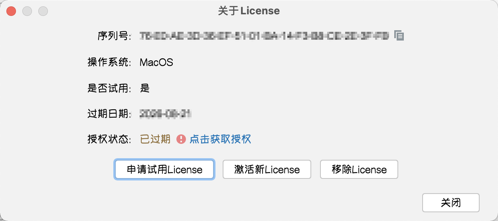
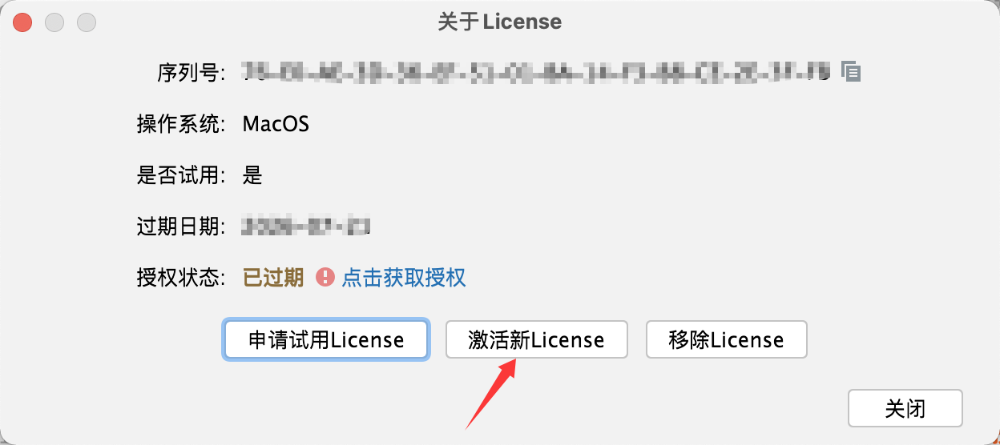
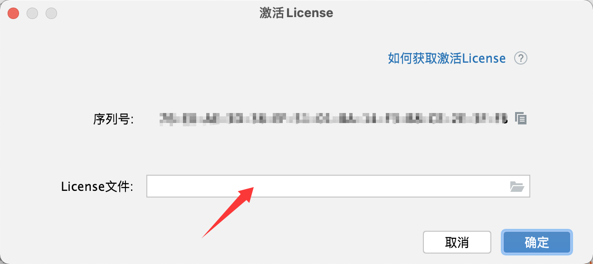

激活指南

[返回主页](../README.md) / [返回Pro主页](../pro/README.md)

***迎新年，行大运~ ㊗️大家新年快乐，马上奔富！***

## ❓ 如何找到操作菜单？

Maven With Me(MPVP)插件:

Tools > Maven Project Version

Maven Update(MPVP)插件:

Tools > Maven Project Version(update)

Maven Search(MPVP)插件:

Tools > Maven Project Version(search)

## ❓ 如何获取序列号？

第一步：打开 **操作菜单**，选择About License菜单

注："操作菜单"在哪里找到？-- 上面栏目/标题《❓ 如何找到操作菜单？》可见详细

第二步：在弹出的对话框中就能找到 序列号  啦，点击右边的  "复制图标"  即可复制序列号到剪贴板~

## ❓ 如何申请试用？

我们一般会在插件发布时进行提供一定天数的试用，如果您未体验到或想延长体验再决定是否激活时可以采用以下方式：

请前往【微信公众号】<a style="color: rgb(255, 76, 65);" href="https://mp.weixin.qq.com/mp/profile_ext?action=home&__biz=MzkyODk0MTA1MA==&scene=124#wechat_redirect" target="_blank">“新程快咖员”</a> 提交申请试用或通过插件的最新版找到插件所属 **操作菜单** 的功能项“About License”菜单 > “申请试用License” 提交申请试用；

注： 试用时需要正常网络链接（内网可能不支持，您可在个人电脑中先进行试用体验【若项目有严格要求不能复制到个人电脑，请注意红线及使用合规的项目】再决定是否进行内网环境的正式激活）

## ❓ 如何正常激活（获取正式授权KEY）？

可通过找到插件所属 **操作菜单** 的功能项“About License”菜单，若插件未正式激活或即将到期点击授权状态项的右侧链接可进行获取授权。也可点击激活新License按钮，然后在激活License对话框中点击如何获取激活License链接查看详细。

## ❓ 获取到授权文件后如何使用？

注意事项： 

+ 请核对是否由邮箱 yyc_xincheng@163.com 发送（需关注是否能接收该邮箱的邮件）。 

+ 授权文件是基于 插件 + 序列号进行专属授权，一机一码，不可在其他机器使用。

我们提供了 插件内选择授权文件 的方法进行激活。当然您也可以手动将解压后的KEY文件（如：MPVP-LICENSE.KEY或MPVP-LICENSE@XX.KEY）复制到用户目录下的mpvp文件夹下（若不存在mpvp文件夹，需要您进行手动创建）。

采用 **插件内选择授权文件** 的操作如下：

第一步：先进行解压邮箱收到的授权zip文件

第二步：打开 **操作菜单**，选择About License菜单

注："操作菜单"在哪里找到？-- 上面栏目/标题《❓ 如何找到操作菜单？》可见详细

第三步：在弹出的对话框中点击激活新License按钮，然后在激活License对话框中的**License文件项**进行点击右侧文件图标进行选择License文件或者输入License文件的所在路径，再**点击确定**即可~

