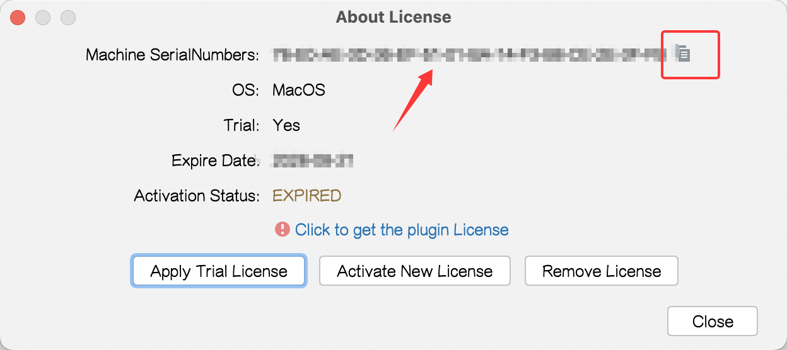
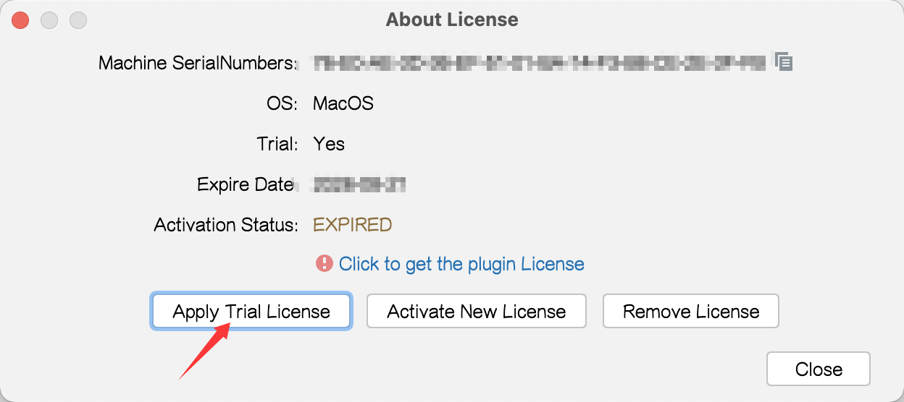
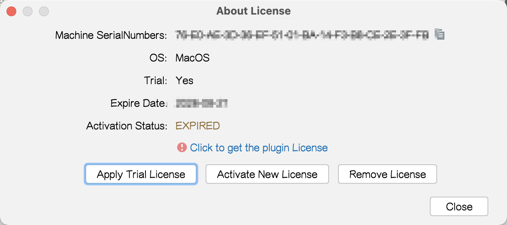
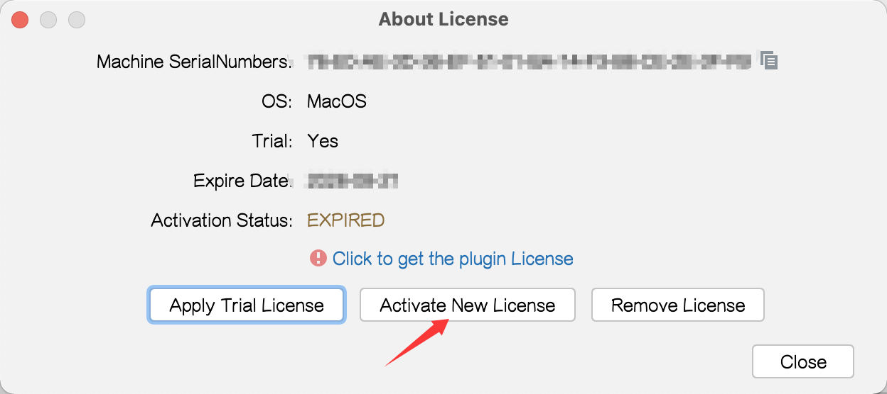
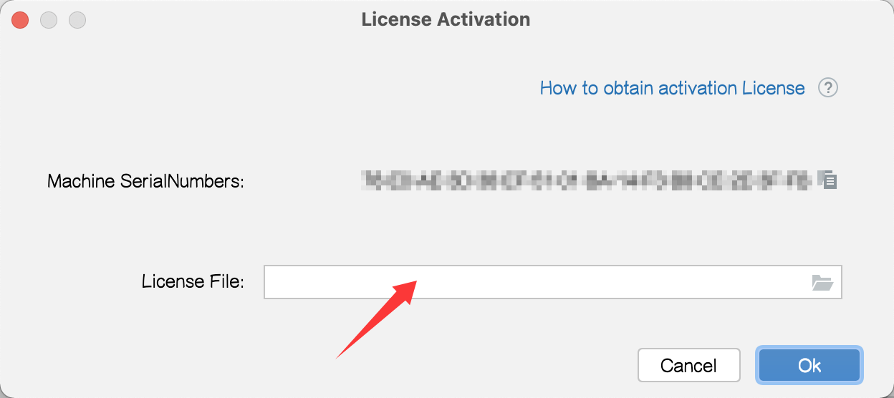

Activation Guide

[Go to Homepage](../README_en.md) / [Go to Pro Homepage](../pro/README_en.md)

***Welcome the New Year, bring on good fortune~ Wishing everyone a Happy New Year and instant wealth!***

## ❓ How to find the operation menu?

Maven With Me(MPVP) plugin:

Tools > Maven Project Version

Maven Update(MPVP) plugin:

Tools > Maven Project Version(update)

Maven Search(MPVP) plugin:

Tools > Maven Project Version(search)

## ❓ How to Get the Machine SerialNumbers?

Step 1: Open the **Operation Menu** and select the About License menu.

Note: Where can the "Operation Menu" be found? -- See the details in the section/title above, "❓ How to find the operation menu?".

Step 2: In the dialog box that pops up, you can find the  Machine SerialNumbers . Click the  "copy icon"  on the right to copy the serial number to the clipboard~

## ❓ How to Apply for a Trial?

We usually offer a certain number of trial days when the plugin is released. If you have not yet tried it, or want to extend the trial before deciding whether to activate, you can use the following method:

Please go to the [WeChat Official Account] <a style="color: rgb(255, 76, 65);" href="https://mp.weixin.qq.com/mp/profile_ext?action=home&__biz=MzkyODk0MTA1MA==&scene=124#wechat_redirect" target="_blank">"新程快咖员"</a> to submit an trial application, or use the latest version of the plugin to find the plugin\'s **Operation Menu** and select the "About License" menu item > "Apply Trial License" to submit a trial application;

Note: A normal network connection is required for the trial (the intranet may not be supported). You can first try the trial on your personal computer [if the project has strict requirements that prevent copying it to a personal computer, please pay attention to the red line and the project\'s usage compliance] and then decide whether to perform the official activation in the intranet environment.

## ❓ How to activate normally (obtain a formal Authorization KEY)?

It can be done through the **Operation Menu** and select the About License menu. If the plugin is not officially activated or is about to expire, click the link below the Authorization Status to obtain a license. You can also click the Activate New License button, and then click the How to obtain activation License link in the activation dialog for more details.

## ❓ How to Use the Authorization File After Obtaining It?

Notes:

+ Please verify that it was sent from the mailbox yyc_xincheng@163.com (pay attention to whether you can receive emails from this mailbox).

+ The authorization file is exclusively authorized based on the plugin + Machine SerialNumbers, one machine one code, and cannot be used on other machines.

We provide the select the authorization file within the plugin method for activation. Of course, you can also manually copy the extracted KEY file (e.g., MPVP-LICENSE.KEY or MPVP-LICENSE@XX.KEY) to the mpvp folder under the user directory (if the mpvp folder does not exist, you need to create it manually).

The operation of **selecting the authorization file within the plugin** is as follows:

Step 1: First extract the authorization zip file received in the mailbox.

Step 2: Open the **Operation Menu** and select the About License menu.

Note: Where can the "Operation Menu" be found? -- See the details in the section/title above, "❓ How to find the operation menu?".

Step 3: In the dialog box that pops up, click the Activate New License button, then in the **License File item** of the Activate License dialog box, click the **file icon on the right** to select the License file or enter the path where the License file is located, then click **OK** button~

