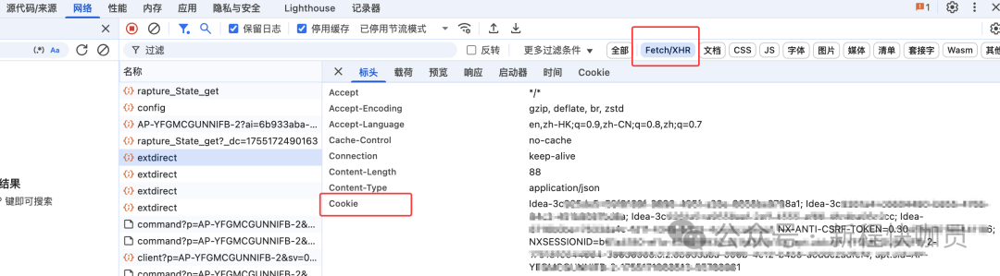

# How to configure Nexus access permissions for IDEA plugin Maven With Me / Maven Search?

This is a scenario where when the Nexus repository has enabled permission access, Maven With Me (MPVP)/Maven Search (MPVP) will not be able to obtain data properly without permission configuration. If your Nexus repository is not configured with permissions, simply keep the plugin's default configuration.

**Permission priority:** Request header configuration permission (Cookie/Authorization...) > Read user permission enabled + Nexus search cache configuration user permission > Read user permission enabled + Maven/Gradle project configuration read user permission

Note: If accessing the Nexus repository is customized through the proxy layer or Nexus services, additional dedicated request headers need to be configured to allow access or access can only be done through configuring request headers. The following mainly introduces common and non special situations.

## How to configure cookies for request header configuration permissions?

Advantages: Flexible and capable of supporting various customized scenarios.

Disadvantage: Cookie expiration may be too short or require many times to configurations.

 **Operation steps:**

  1. Login the Nexus repository system and open the developer control tool (Google Chrome - F12).

  2. Find the network request, view the cookies, and copy them all. As shown in the figure:

  3. In the request header configuration, configure cookies and finally enter search criteria as needed to query. As shown in the figure:

Note: Select 'No' to Read User(permission). If selected 'Yes', additional read user permission logic will be executed ..

## How to configure user permissions for nexus search cache configuration?

Advantages: The highest reading efficiency does not depend on Maven/Gradle configuration. Can directly and accurately obtain the user permissions corresponding to the URL. Even if there are multiple Nexus repositories with different URLs, they can be accessed quickly.

Disadvantage: Need to manually edit the JSON configuration file

**Operation steps:**

  1. Find the URL to configure user permissions in the user home/mpvp/search-nexus-cache.json
  
Note:

If there is no file or corresponding URL, you need to first use a plugin to input search criteria for the request.

Then choose to close the IDE (usually saving every 360 minutes by default, but closing the IDE will directly save the data) or adjust the Nexus search cache save period to 1 minute before viewing.

How to adjust the Nexus search cache retention period?

Configure the search.nx.cache-save-period property in conf.properties

There are two types of configuration files supported. If there is no manual creation, the path is as follows:
    
    global configuration: user home/mpvp/conf.properties

    project configuration: user project work dir/.idea/mpvp/conf.properties (Highest priority)

Example of configuration values:
    
      
    # search nexus cache save period (Unit: minutes, value should be > 0, use default value 360 when not configured or illegal)-- 2.1.x added
    search.nx.cache-save-period=1  
      
      

2\. Add 'username' and 'password' attributes to the corresponding URL properties and configure the account and password with access permissions.

with http://172.16.0.74:8081/ For example, the complete configuration is as follows:
    
    
       "http://172.16.0.74:8081/" : {  
          "timeout" : "5000",  
          "switchVersionIndex" : 1,  
          "username" : "your_username",  
          "password" : "your_password",  
          "success" : true,  
          "timestamp" : 1753161889507  
        }

  

  3. Select Read User(permission) 'Yes' and finally enter the search criteria as needed to query. As shown in the figure: 

Note: If request headers are configured Cookie / Authorization in the request header configuration, the configuration here will not take effect.

After being read, the account and password here will be encoded as characters starting with `v@str:7640737472:`, so the account and password cannot start with this special character.

## Maven/Gradle project configuration reads user permissions?

Advantages: No additional user permissions need to be configured.

Disadvantage: The Maven/Gradle project configuration requires the user permission configuration corresponding to the current request URL. Additionally, reading the configuration for the Gradle project may take a considerable amount of time. (Approximately 1-4 seconds)

**Operation steps:**

Select Read User(permission) 'Yes' and finally enter the search criteria as needed to query. As shown in the figure:

Note: If request headers are configured Cookie / Authorization in the request header configuration, the configuration here will not take effect.

## Summary

The above introduces several ways to configure Nexus access permissions for Maven With Me(MPVP) / Maven Search(MPVP). You can choose according to your actual situation~

**When there are no special customization requirements:**

It is recommended to use Nexus search cache configuration for configuring permissions first (especially for Gradle projects where automatic recognition and configuration can be time-consuming).    
If there are corresponding user permission configurations for accessing URLs and opening projects, the permissions can also be read directly through the plugin's automatic recognition configuration capability.

**When there is a special customization requirement:**

Use request header configuration+read user permission capability (as needed)?

  

