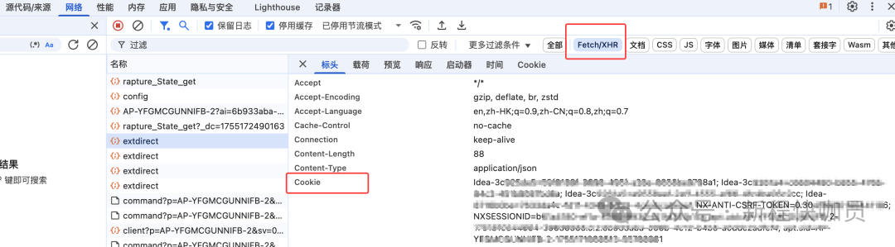
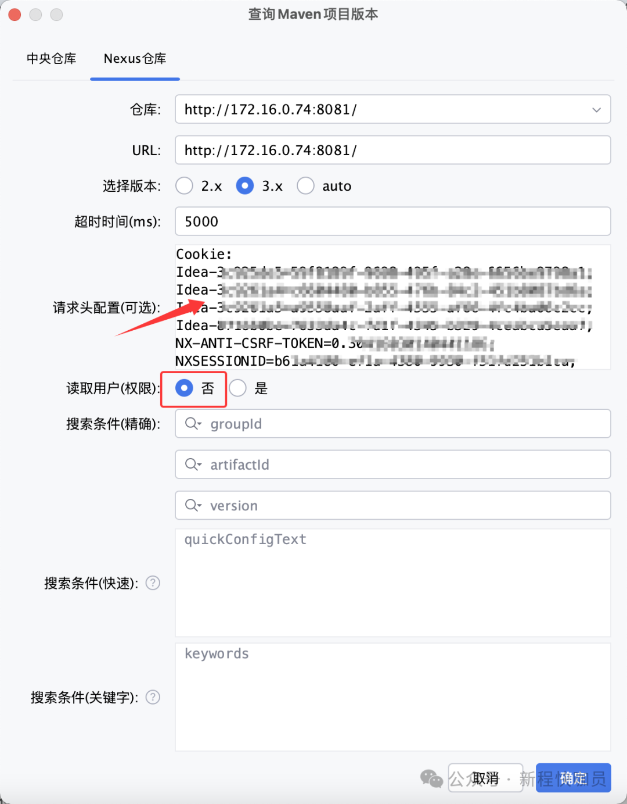
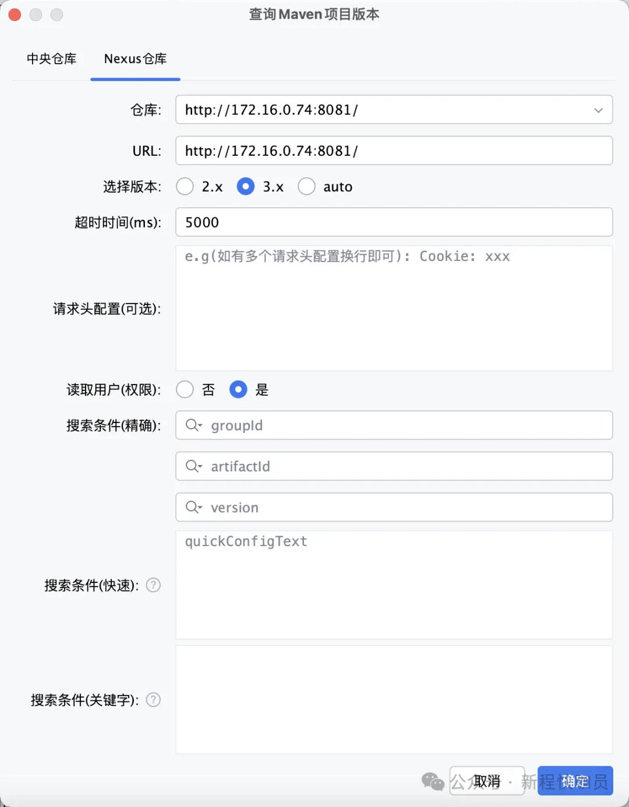

# IDEA插件Maven With Me / Maven Search如何配置Nexus访问权限？

这里介绍的是当Nexus仓库开启了权限访问，若Maven With Me(MPVP) / Maven Search(MPVP)不进行权限配置，将无法正常获取数据的场景。若您的Nexus仓库未配置权限，则保持插件默认配置即可。

 **权限优先级：** 请求头配置权限（Cookie / Authorization ...） > 读取用户权限开启 + nexus搜索缓存配置用户权限 > 读取用户权限开启 + maven / gradle项目配置读取用户权限

注意：如果访问Nexus仓库经过代理层或Nexus服务存在定制化，则需要额外配置专属的请求头允许访问或只能通过配置请求头访问。下面主要介绍常规无特殊的情况。

## 请求头配置权限如何配置Cookie？

优点：灵活，可支持各种定制化场景。

缺点：Cookie时效可能过短，或需要多次配置。

 **操作步骤：**

  1. 登录Nexus仓库，打开开发者控制工具 (谷歌浏览器 - F12)。

  2. 找到网络请求，查看Cookie并全部复制。如图所示：

  3. 在请求头配置中，进行配置Cookie，最后按照需要输入搜索条件查询即可。如图所示：

注： 读取用户(权限) 选择否。如果选择是，会执行额外的读取用户权限逻辑...

## nexus搜索缓存配置如何配置用户权限？

优点：读取效率最高，不依赖maven/gradle配置。能直接精准获取URL对应的用户权限。即使存在多个不同URL的Nexus仓库，也能快速访问。

缺点：需要手动编辑json配置文件

 **操作步骤：**

  1. 找到用户主目录/mpvp/search-nexus-cache.json中要配置用户权限的URL  
  
注：

如果不存在文件或对应的URL，需要先使用插件输入搜索条件进行请求。

然后选择关闭IDE（默认一般是间隔360分钟保存一次，但关闭IDE会直接保存数据）或调整nexus搜索缓存保存周期为1分钟再进行查看。  
  
如何调整nexus搜索缓存保存周期？   
  
在conf.properties中配置search.nx.cache-save-period属性即可。

其中配置文件支持两种，如果不存在手动创建即可，路径如下：
    
    全局配置: 用户主目录/mpvp/conf.properties  
      
    项目配置: 用户项目工作目录/.idea/mpvp/conf.properties (优先级最高)  
      
    

配置值示例：
    
          
      
    # 搜索nexus缓存保存周期（单位：分钟，配置值应 > 0，未配置或不合法时使用默认值 360）-- 2.1.x新增  
    search.nx.cache-save-period=1  
      

2\. 在对应的URL的属性中增加 ‘username’ 和 ‘password’ 属性并配置拥有权限访问的账号及密码。

以 http://172.16.0.74:8081/ 为例，完整配置如下：
    
    
       "http://172.16.0.74:8081/" : {  
          "timeout" : "5000",  
          "switchVersionIndex" : 1,  
          "username" : "your_username",  
          "password" : "your_password",  
          "success" : true,  
          "timestamp" : 1753161889507  
        }

  

  3. 读取用户(权限) 选择是，最后按照需要输入搜索条件查询即可。如图所示：

注： 如果在请求头配置中配置了 Cookie / Authorization 请求头，这里的配置不会生效。

这里的账号及密码被读取后会进行编码为 `v@str:7640737472:` 开始的字符，所以账号和密码不能以这个特殊的字符作为开始。

## maven / gradle项目配置读取用户权限 ?

优点：无需额外配置用户权限。

缺点：maven / gradle项目配置中需要存在当前请求URL所对应的用户权限配置。另外gradle项目读取配置可能会耗时比较久。（大概1~4s）

 **操作步骤：**

读取用户(权限) 选择是，最后按照需要输入搜索条件查询即可。如图所示：

注： 如果在请求头配置中配置了 Cookie / Authorization 请求头，这里的配置不会生效。

## 总结

以上介绍了Maven With Me(MPVP) / Maven Search(MPVP)如何配置Nexus访问权限的几种方式，大家可根据实际情况选择~

**无特殊定制化需求时：**

优先推荐采用nexus搜索缓存配置进行配置权限（特别是gradle项目自动识别配置会比较耗时）。   
如果访问URL及打开的项目中存在对应URL的用户权限配置，也可直接通过插件的自动识别配置能力读取权限。

**特殊定制化需求时：**

使用请求头配置 + 读取用户权限能力（按需）？

  

